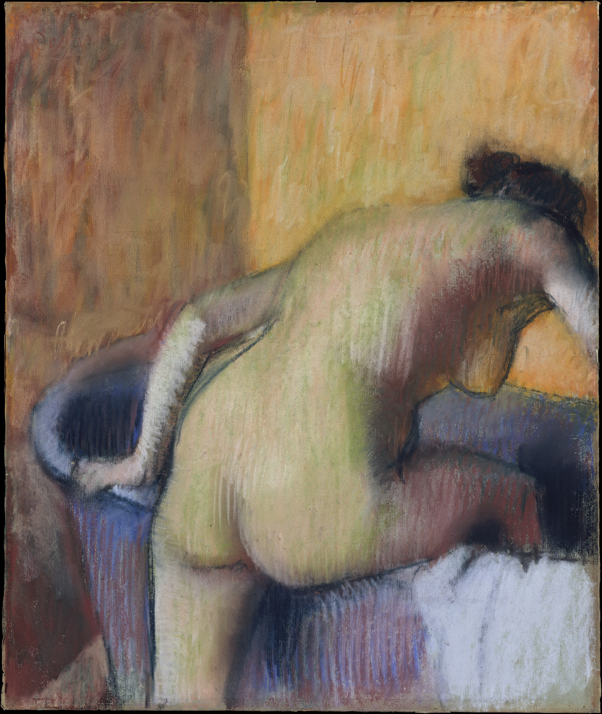

## 基本信息

- 作者：[[德加 Edgar Degas]]
- 创作年代：约 1890
- 材质：纸上粉彩 (*not from wiki*)
- 尺寸：(*not from wiki*)
- 现存地：(*not from wiki*)

## 画面与技法

裸女正一脚跨入浴盆的瞬间——德加捕捉了"日常动作的几何性"。同样**没有脸**——德加在浴女系列中刻意回避脸部，把模特变成纯粹的形体线条 (*not from wiki*)。

## 历史背景

(*not from wiki*) 1890 年代德加继续在浴女主题上深入，更多使用粉彩。视力进一步衰退使他转向更概括、更色块化的处理。

## 图片清单

| 编号 | 出自 | 描述 |
|---|---|---|
| 01 | [[045｜德加：为什么印象派以他结束？]] | 一脚跨入浴盆的裸女 |

## 出现在

- [[045｜德加：为什么印象派以他结束？]]
