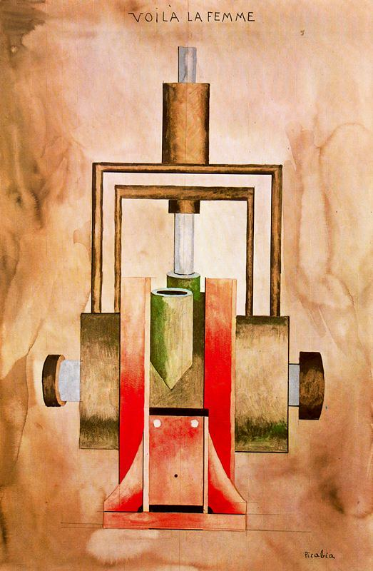

## 基本信息

- 作者：[[毕卡比亚 Francis Picabia]]
- 创作年代：1915
- 材质：纸面油画 / 水彩 (*not from wiki*)
- 尺寸：年代不详 (*not from wiki*)
- 现存地：私人收藏 (*not from wiki*)

## 画面与技法

[[毕卡比亚 Francis Picabia]] **达达"机器画女人"期**的开端作品——1915 年路过纽约、与已经"风声水起"的 [[杜尚 Marcel Duchamp]] 重新合流"达达上了"之后画的。

**用机器图样代替女性身体**——这一思路与 [[新娘甚至被单身汉剥光了衣服 The Bride Stripped Bare by Her Bachelors]] (杜尚同时期搞的装置) 一致，是纽约达达"用机器表现性"的视觉纲领。

## 历史背景

(*not from wiki*) 1915 年毕卡比亚以法国军方代表名义"去古巴采购蔗糖"，半路上停在纽约，结果"把蔗糖忘在脑后，和杜尚一起达达上了"。

## 图片清单

| 编号 | 出自 | 描述 |
|---|---|---|
| 01 | [[091｜毕卡比亚：如何用绘画表现达达主义？]] | 整体图 — 机器装置作为女性身体 |

## 出现在

- [[091｜毕卡比亚：如何用绘画表现达达主义？]]
