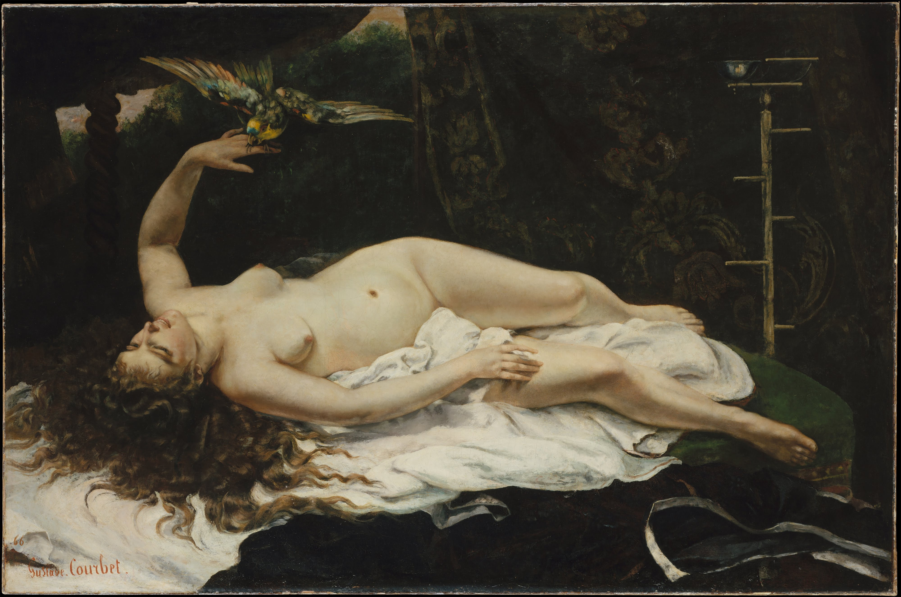

## 基本信息

- 作者：[[居斯塔夫·库尔贝 Gustave Courbet]]
- 创作年代：1866
- 材质：布面油画 (*not from wiki*)
- 尺寸：约 130 × 196 cm (*not from wiki*)
- 现存地：纽约大都会艺术博物馆 Metropolitan Museum of Art, New York (*not from wiki*)

## 画面与技法

裸女躺卧床上、长发披散、抬手让一只彩鹦鹉停在指尖。**比《浴女》"驯化"得多——这是库尔贝 1860 代中期"浪子回头"期可被沙龙接受的题材类型**：风景、打猎、女人。

## 历史背景

顾衡 035 明示：

> 这么闹腾了几年后，库尔贝开始画风景，画打猎，画女人，这些题材，就是官方沙龙可接受的。

本作是 **1866 沙龙入选**作品 (*not from wiki*)。但官方"赶紧买他一幅画、给他颁个奖"的撮合**最终没弄成**——库尔贝咬定是 [[拿破仑三世 Napoleon III]] 作梗，**反而更激进**（→ 1863《集会归来》喝醉神父→双沙龙拒收）。

## 图片清单

| 编号 | 出自 | 描述 |
|---|---|---|
| 01 | [[035｜库尔贝：为什么现实主义的开创者争议那么大？]] | 床上裸女与肩头鹦鹉 |

## 出现在

- [[035｜库尔贝：为什么现实主义的开创者争议那么大？]]
