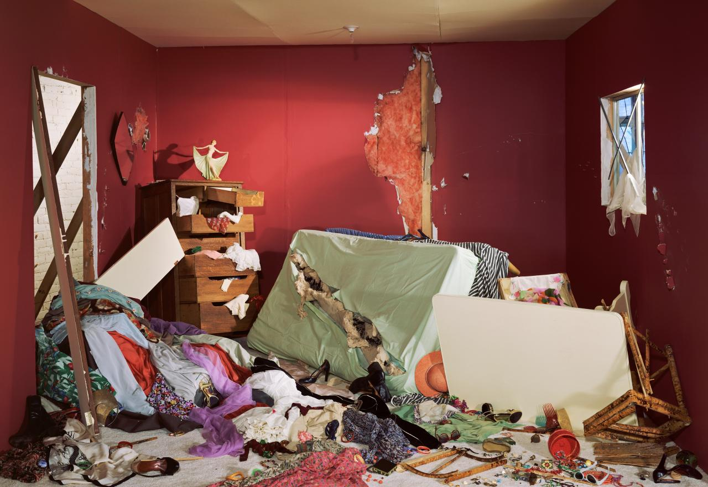

## 基本信息

- 作者：[[杰夫·沃尔 Jeff Wall]]
- 创作年代：1978
- 材质：(*not from wiki*) 灯箱透明胶片 (transparency in lightbox) ——杰夫·沃尔自创的标志介质
- 尺寸：(*not from wiki*) 159 × 234 cm
- 现存地：(*not from wiki*) 加拿大国家美术馆 (National Gallery of Canada, Ottawa)

## 画面与技法

(*not from wiki*) 沃尔租下一名妓女的真实公寓，把房间彻底翻烂——床垫掀开、衣服撕裂、首饰甩在地上、家具倾倒——然后用大画幅相机拍摄，制成**背光灯箱透明片**。整个画面构图取自 [[德拉克罗瓦 Eugène Delacroix]] 的 [[萨尔丹纳帕拉之死 The Death of Sardanapalus]]：**红色调主导、对角线倾斜入画、混乱的物件堆向画面深处**——但把 1827 年宫廷暴行换成了 1978 年都市卧室的劫掠。

## 历史背景

(*not from wiki*) 杰夫·沃尔是当代摄影从纪实摄影转向**搬演式（staged）摄影**的关键人物——他的灯箱片在博物馆里像古典油画一样悬挂，把摄影正式带入油画的尺度与语言。本作是他的早期成名作之一，也是当代艺术对 19 世纪浪漫主义视觉经典的明确致敬。

## 在课程中的角色

顾衡 034 用本画作证"**德拉克罗瓦在艺术史上的重要地位**"：**150 年后**仍然有一线当代艺术家（沃尔）借《萨尔丹纳帕拉之死》构图来表达自己——这不是技术的复刻，而是图像在艺术史上的**长尾影响力**的证明。

## 图片清单

| 编号 | 出自 | 描述 |
|---|---|---|
| 01 | [[034｜德拉克罗瓦：为什么他成了浪漫主义的旗手？]] | 全画 |

## 出现在

- [[034｜德拉克罗瓦：为什么他成了浪漫主义的旗手？]] —— 致敬德拉克罗瓦《萨尔丹纳帕拉之死》的当代摄影作品
