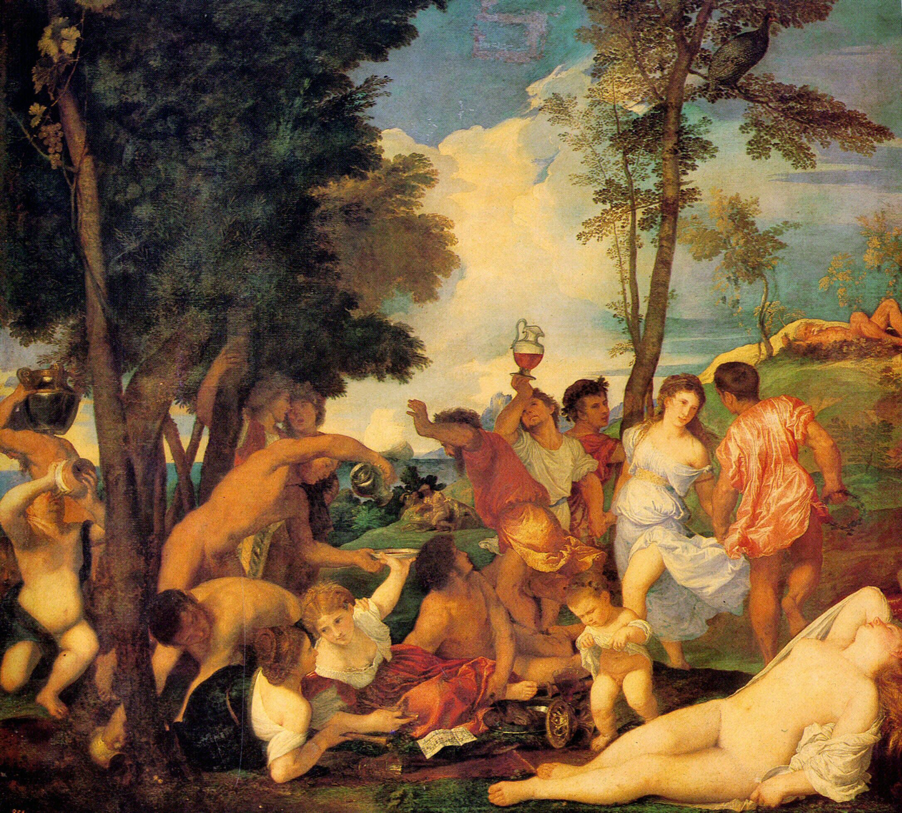

## 基本信息

- 作者：[[提香 Titian]]
- 创作年代：1523-1526
- 材质：布面油画
- 尺寸：175 × 193 cm (*not from wiki*)
- 现存地：马德里普拉多博物馆 (*not from wiki*)

## 画面与技法

希腊神话场景：安德罗斯岛溪流变成酒水，岛民醉饮狂欢。前景左侧白衣女子持杯起舞、右下角裸体维纳斯（一说阿里阿德涅）斜躺、远处仍有人不停喝酒、唱乐。

**顾衡解读**（016）：对照师父贝利尼 [[诸神的盛宴 The Feast of the Gods]]——提香在这里完全摆脱线条束缚，**色彩获得自由**、光彩四溢。徒弟回忆提香工作流："打完基础就把画翻过来面朝墙放，过几个月再像医生瞧病人一样动笔"——证明他直接用色彩塑造形体，不作素描。

## 历史背景

(*not from wiki*) 1523-1526 为费拉拉公爵 Alfonso d'Este 雪松厅订制系列之一——同套还有贝利尼 *Feast of the Gods* 和提香 *Worship of Venus*。题材取自希腊作家 Philostratus 的 *Imagines*。

## 图片清单

| 编号 | 出自 | 描述 |
|---|---|---|
| 01 | [[016｜提香：为什么业界评价比达芬奇还高？]] | 整体图 |

## 出现在

- [[016｜提香：为什么业界评价比达芬奇还高？]]
