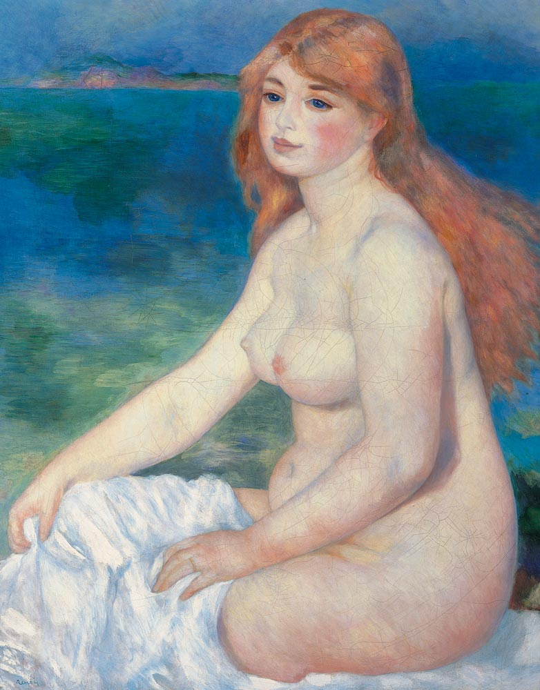

## 基本信息

- 作者：[[雷诺阿 Pierre-Auguste Renoir]]
- 创作年代：1882
- 材质：布面油画 (*not from wiki*)
- 尺寸：81 × 65.4 cm (*not from wiki*)
- 现存地：克拉克艺术学院 Sterling and Francine Clark Art Institute, Williamstown (*not from wiki*)

## 画面与技法

043 顾衡将本作 (1882) 与《[[浴女们 The Large Bathers]]》(1887)、《[[翘二郎腿的浴女 Large Bather with Crossed Legs]]》(1904) 并列为雷诺阿"晚期画裸女"系列——是 1881 意大利之行后宣布"我的印象派走到尽头，我是安格尔主义者"之后的代表作。

但顾衡也指出：**雷诺阿和安格尔的共同点仅限于喜欢画裸女，两个人的风格还是有很大差异的**——

1. **"小骨架胖乎乎"**：雷诺阿一辈子喜欢画小骨架胖乎乎的女人，与 [[安格尔 Jean-Auguste-Dominique Ingres]] 拉长躯干的"骨"美学不同——顾衡判语："**安格尔画的是骨，而雷诺阿画的是肉**"。
2. **拒斥宏大叙事**：[[现实主义 Realism]] "拒斥画以载道、拒斥宏大叙事"的理念被雷诺阿保留下来——"思想啊，理念啊，这些东西在雷诺阿看来，重要性还不如一个羊角面包"。雷诺阿原话："**我只是个画家，我想画出美的东西，这个世界上的丑陋难道还不够多吗？**"
3. **无主题 / 装饰性**：雷诺阿的裸女都是无主题的，背景只是胡乱涂抹，消解了故事情节——让作品表现出很强的装饰性。

模特是雷诺阿未来妻子艾琳·夏里戈 Aline Charigot (*not from wiki*)。

## 历史背景 (*not from wiki*)

1881–1882 年雷诺阿意大利之行后所作，是他"安格尔主义"转向后的最早成果之一——但顾衡指出此画展现的是"血液循环良好的质感"，与安格尔的冷峻线条形成鲜明对比。

## 图片清单

| 编号 | 出自 | 描述 |
|---|---|---|
| 01 | [[043｜雷诺阿：妥协如何造就大师？]] | 全图，海边坐姿裸女 |

## 出现在

- [[043｜雷诺阿：妥协如何造就大师？]]
