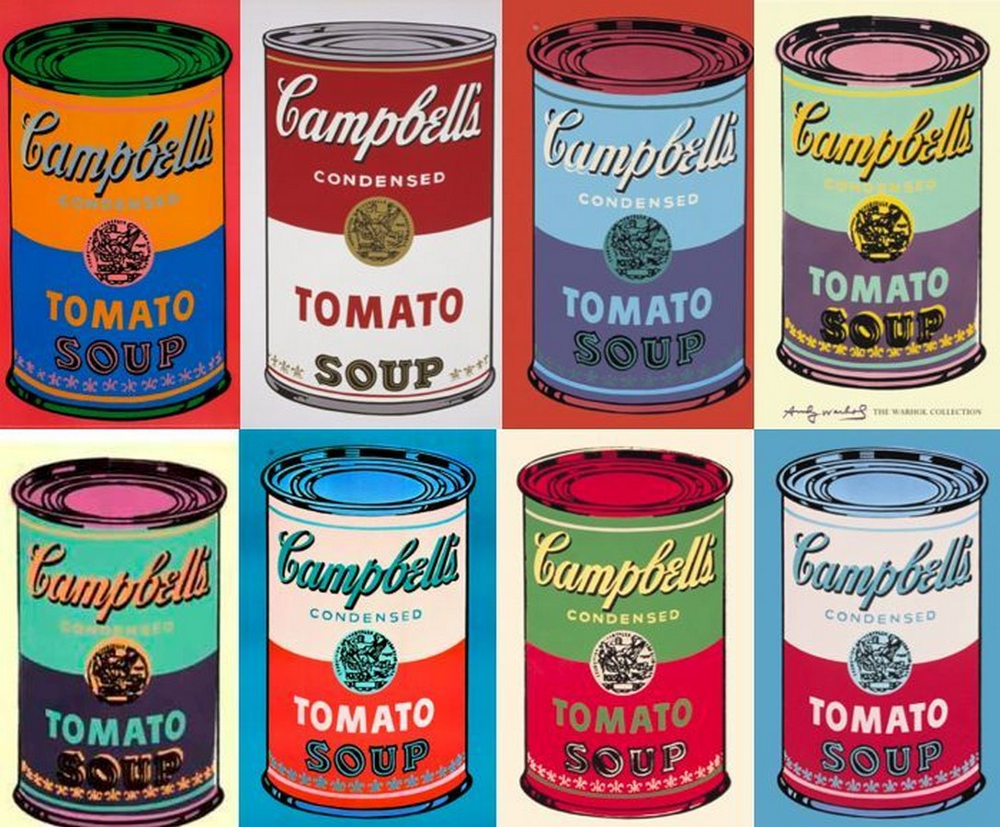

## 基本信息

- 作者：[[安迪·沃霍尔 Andy Warhol]]
- 创作年代：1962
- 材质：32 块画布上的合成聚合物涂料（早期）/ [[丝网印刷 Silkscreen]]
- 尺寸：（*not from wiki*）每块 50.8 × 40.6 cm，共 32 块
- 现存地：（*not from wiki*）纽约现代艺术博物馆 MoMA

## 画面与技法

把美国超市里 32 种口味的金宝汤罐头**每种画成一幅画，全部同尺寸并排陈列**——画面几乎一模一样，只有罐身标签上的"Tomato / Chicken Noodle / ..."字样不同。

顾衡 098 把它列为 [[安迪·沃霍尔 Andy Warhol]] 三大代表作之一，说明波普艺术的核心选材原则——**直接采用商品包装本身**作为艺术对象，连"再美化"的程序都被取消。

## 历史背景 (*not from wiki*)

- 1962 年 7 月在洛杉矶 Ferus Gallery 首展——展出时画作并排陈列在画廊货架上，模拟超市货架。当时只卖出几幅；后来沃霍尔自己买回，整套留在工作室。
- 据传沃霍尔之所以选金宝汤，是因为他母亲每天给他做的就是金宝汤——日常 / 廉价 / 大众，正是他想入画的属性。

## 图片清单

| 编号 | 出自 | 描述 |
|---|---|---|
| 01 | [[098｜波普艺术：流行文化如何成为艺术？]] | 32 罐网格陈列照 |

## 出现在

- [[098｜波普艺术：流行文化如何成为艺术？]]
