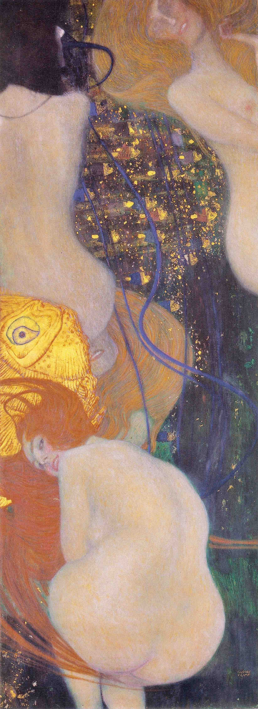

## 基本信息

- 作者：[[克里姆特 Gustav Klimt]]
- 创作年代：1901–1902
- 材质：（*not from wiki*）布面油画
- 尺寸：（*not from wiki*）181 × 67 cm
- 现存地：（*not from wiki*）瑞士索洛图恩美术馆 Kunstmuseum Solothurn

## 画面与技法

[[克里姆特 Gustav Klimt]] **热衷于情色**这一风格特征的代表作（顾衡 073）——"他画了很多《金鱼》这样的裸体画，把**女性胴体的感官之美推向了极致**"。

主体为一个回头朝向观众、扭着身体、笑容挑衅的红发裸女，与游动的金鱼共处水中——是克里姆特对维也纳大学三联画风波后批评者的回应。

## 历史背景 (*not from wiki*)

- 据载克里姆特最初想给本作起名《**致我的批评者**》（To My Critics），以裸女撅起的臀部回应学院抗议者
- 后改名《金鱼》得以公开展出

## 图片清单

| 编号 | 出自 | 描述 |
|---|---|---|
| 01 | [[073｜克里姆特：什么是维也纳分离派？]] | 金鱼全图 |

## 出现在

- [[073｜克里姆特：什么是维也纳分离派？]]
