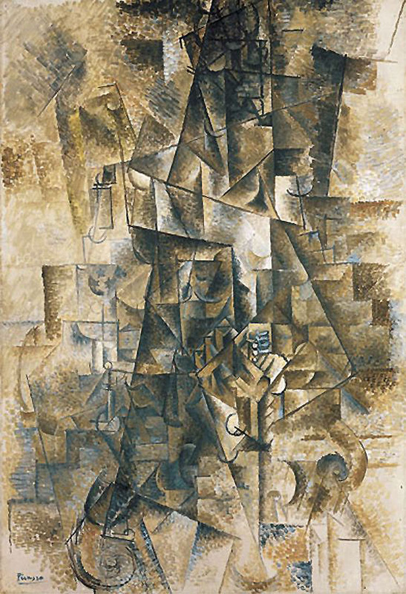

## 基本信息

- 作者：[[毕加索 Pablo Picasso]]
- 创作年代：1911
- 材质：布面油画 (*not from wiki*)
- 尺寸：130 × 89.5 cm (*not from wiki*)
- 现存地：纽约古根海姆博物馆 Solomon R. Guggenheim Museum (*not from wiki*)
- 备注：又译《手风琴家》(*The Accordionist*)，更常用的英文标题就是 The Accordionist

## 画面与技法

[[分析立体主义 Analytical Cubism]] 最高抽象度作品之一——

- 顾衡（066）以此作和《[[我的美人（女吉他手）My Beauty (Woman with Guitar)]]》并举，"这个把镜子打得更碎的办法，画得是什么我是完全看不出来了"。
- 画面几乎完全溶解为褐 / 灰 / 黄交错的几何切面，**仅在题材层面提供"乐器演奏者"的辨识线索**。
- 与同年的《[[有朗姆酒瓶的静物 Still Life with Bottle of Rum]]》一样属"把镜子打得更碎"的极限实验。

## 历史背景 (*not from wiki*)

- 1911 年夏天毕加索在法国南部 Céret 度假期间所作；与 [[勃拉克 Georges Braque]] 在同地同期作画，两人风格几乎不可分辨。
- 同年作品大量探索"乐器演奏者 / 静物 / 单人坐像"等少数几个固定题材——这本身就是顾衡所谓"分析立体主义两条退路"中的第一条：**只画大家都熟悉的题材**。

## 图片清单

| 编号 | 出自 | 描述 |
|---|---|---|
| 01 | [[066｜毕加索3：什么是分析立体主义？]] | 全图——分析立体主义抽象度极限实验之一 |

## 出现在

- [[066｜毕加索3：什么是分析立体主义？]] —— [[分析立体主义 Analytical Cubism]] 抽象度极限实验
