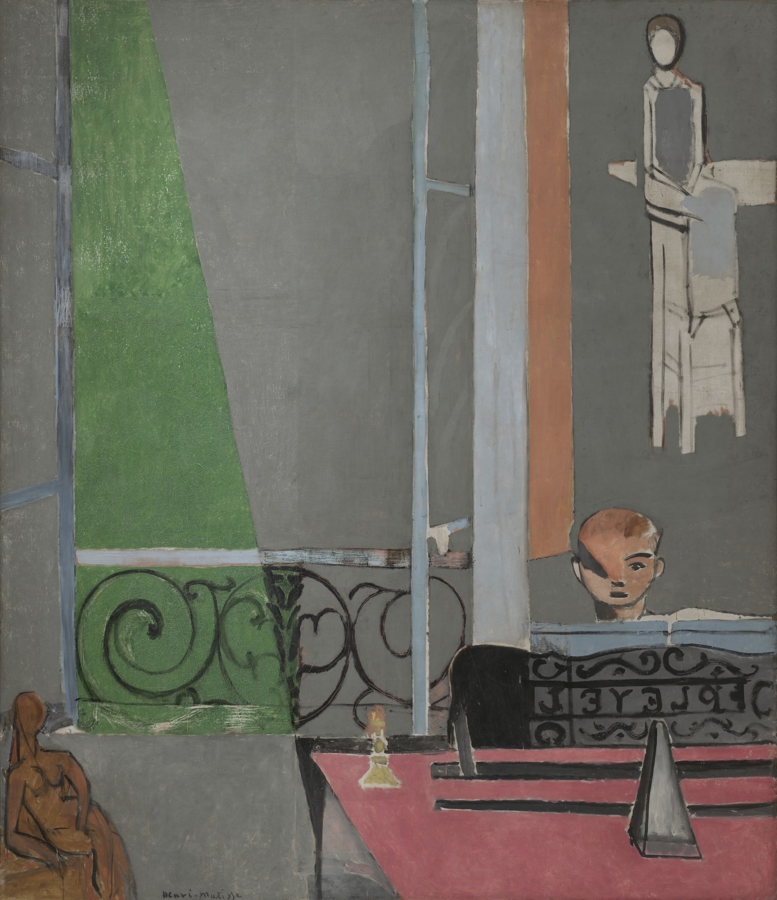

## 基本信息

- 作者：[[马蒂斯 Henri Matisse]]
- 创作年代：1916
- 材质：布面油画 (*not from wiki*)
- 尺寸：245.1 × 212.7 cm (*not from wiki*)
- 现存地：纽约现代艺术博物馆 (MoMA) (*not from wiki*)

## 画面与技法

一战期间马蒂斯**短暂进入立体主义时期**的代表作。画面中央马蒂斯长子 Pierre 在钢琴前练习；窗外一片青绿色梯形，钢琴谱架以**强烈几何分割**面化处理；左下女性人体雕塑、右上《[[读书的女人 (马蒂斯) Woman Reading (Matisse)|端坐的女人]]》画中画。

顾衡指出：马蒂斯并没有走到**分析立体主义**那么远，更**和综合立体主义挨不上关系**。他的所谓立体主义，**不过就是他在 1908 年嘲笑过的勃拉克** [[埃斯塔克的房子 Houses at L'Estaque|《埃斯塔克的房子》]]——也就是 **把画面中的所有元素进行严格的几何化**。

## 历史背景 (*not from wiki*)

1916 年一战激战正酣，马蒂斯因年龄原因不能服役，留在巴黎与 Issy。本画**几乎被普遍视为马蒂斯一生绘画中最严谨、最克制的一幅**——硬边几何、灰绿主调、近乎建筑制图般的构图。

讽刺意味：1908 年正是马蒂斯作为秋季沙龙评委吐槽勃拉克 L'Estaque 风景"这就是一些小方块呀"——8 年后他自己也开始画方块。

## 图片清单

| 编号 | 出自 | 描述 |
|---|---|---|
| 01 | [[068｜立体主义，除了毕加索还值得了解什么？]] | 一战期间马蒂斯几何化人物 / 室内场景 |

## 出现在

- [[068｜立体主义，除了毕加索还值得了解什么？]] —— 马蒂斯"立体主义客串"的代表作
