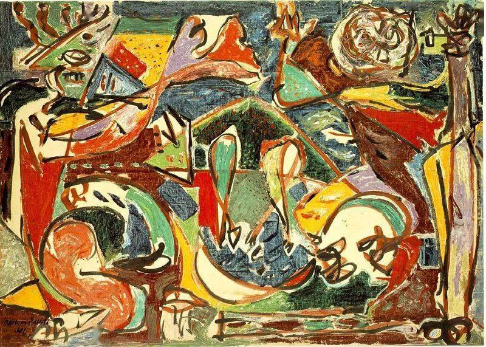

## 基本信息

- 作者：[[波洛克 Jackson Pollock]]
- 创作年代：1946
- 材质：(*not from wiki*)
- 尺寸：(*not from wiki*)
- 现存地：芝加哥艺术博物馆 (*not from wiki*)

## 画面与技法

与《[[茶杯 (波洛克) The Tea Cup]]》同年的作品，仍是超现实主义自动绘画路线。是滴画法觉醒前的"临界态"。

## 历史背景 (*not from wiki*)

1946 年——距 1947 年波洛克"开窍"创造滴画法只剩一年。

## 图片清单

| 编号 | 出自 | 描述 |
|---|---|---|
| 01 | [[096｜波洛克：什么是当代艺术的第一个流派？]] | 钥匙 The Key (1946) |

## 出现在

- [[096｜波洛克：什么是当代艺术的第一个流派？]]
