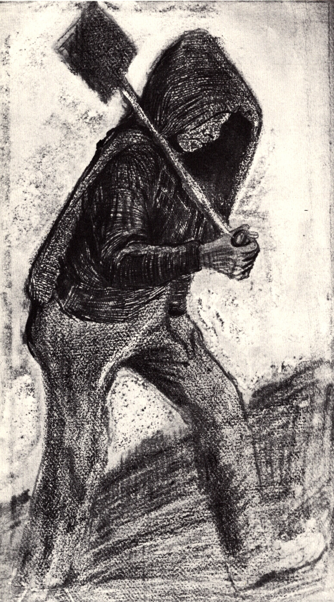

## 基本信息

- 作者：[[凡·高 Vincent van Gogh]]
- 创作年代：1879
- 材质：素描 (*not from wiki*)
- 尺寸：—
- 现存地：—

## 画面与技法

凡·高被福音派教会从博里纳日煤矿开除后画的早期素描之一。057 中顾衡用这批素描（《铲煤工》《壁炉边》《在路上》）说明凡·高 26 岁刚转行画家时基本功的粗糙，从而衬托弟弟 [[提奥 Theo van Gogh]] 每月寄 150 法郎的厚道。

## 历史背景 (*not from wiki*)

凡·高 1879 年初在比利时博里纳日（Borinage）煤矿区充任福音派"无薪见习传教助手"，1880 年正式宣布要当画家。这一批素描定格了他对底层劳动者的最初凝视，预示了后来 [[吃土豆的人 The Potato Eaters]] 的母题。

## 图片清单

| 编号 | 出自 | 描述 |
|---|---|---|
| 01 | [[057｜凡·高1：为什么说他"性格决定命运"？]] | 凡·高 1879 年素描《铲煤工》 |

## 出现在

- [[057｜凡·高1：为什么说他"性格决定命运"？]]
