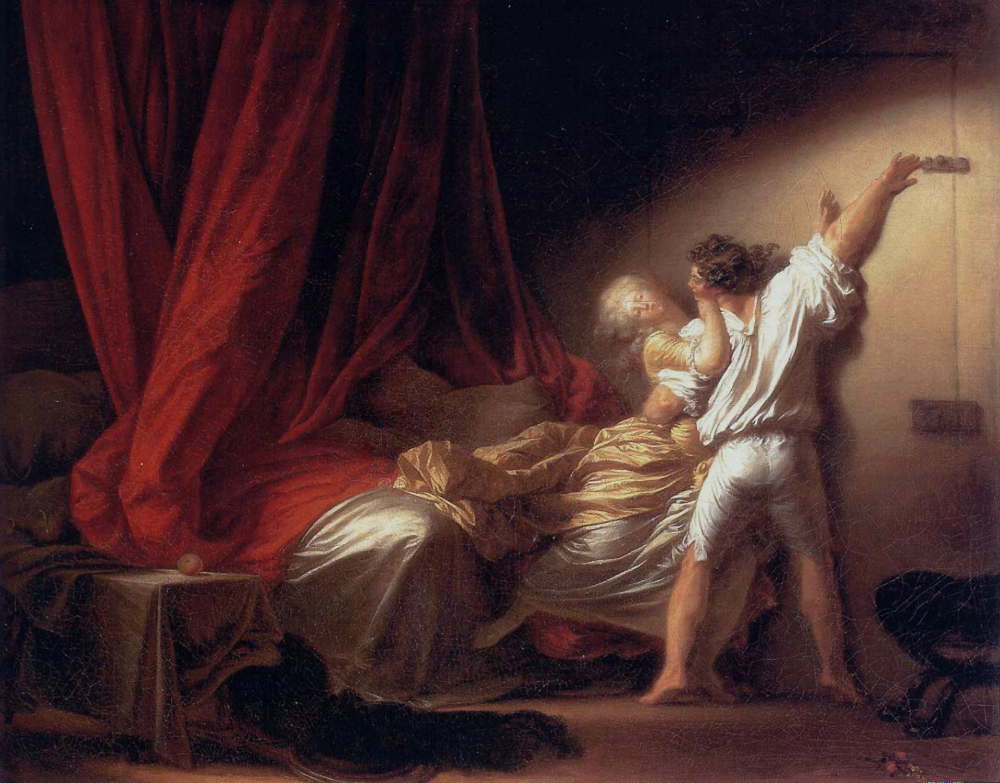

## 基本信息

- 作者：[[弗拉戈纳尔 Jean-Honoré Fragonard]]
- 创作年代：1778 (顾衡引)
- 材质：布面油画 (*not from wiki*)
- 尺寸：约 73 × 93 cm (*not from wiki*)
- 现存地：卢浮宫 Louvre, Paris (*not from wiki*)

## 画面与技法

一对男女在卧室内角力——年轻男子一只脚踮地、伸长身子去**插上门闩**，另一只手揽抱着身体半推半就向后仰倒的女子。画面右侧大半被一张**红绸床帐**占据，床上一颗苹果隐喻原罪 (*not from wiki*)。光线对角斜打——从左上到右下——把动作的张力强化到舞台高潮。

## 顾衡解读（029）

029 引此作（与 [[偷吻 The Stolen Kiss]]、[[秋千 The Swing]] 一道）作为弗拉戈纳尔**"刻画男女调情的状态"**的代表——"**注重过程，轻视结果**"的情爱观直接落到画面上：

> 在洛可可时期，挑逗和勾引就是全部。女方欲拒还迎的半推半就，这个才是乐趣的全部。

## 历史背景

(*not from wiki*) 与 *L'Adoration des bergers*（《牧羊人朝拜》）一同为某位贵族顾客订制——两件原配为一对，构成"世俗欲望 vs 神圣纯洁"的对照。

## 图片清单

| 编号 | 出自 | 描述 |
|---|---|---|
| 01 | [[029｜洛可可为什么那么香艳？]] | 整体图 |

## 出现在

- [[029｜洛可可为什么那么香艳？]]
