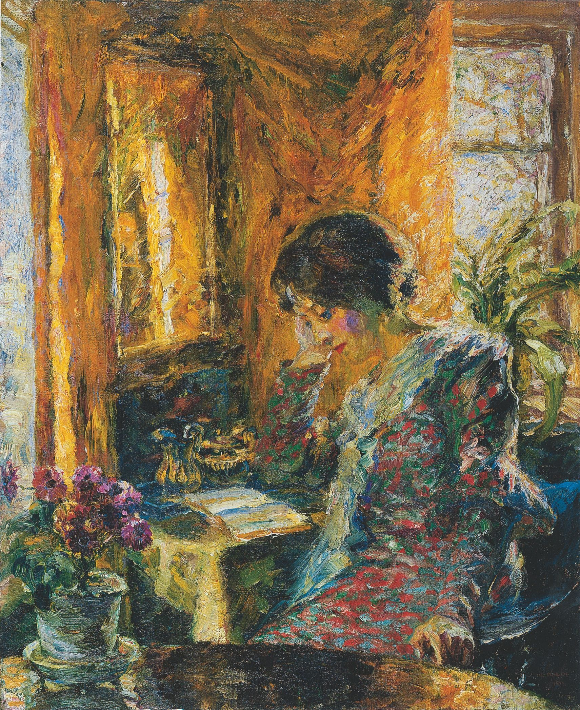

## 基本信息

- **作者**：[[诺尔德 Emil Nolde]]
- **创作年代**：1904
- **材质**：布面油画 (*not from wiki*)
- **尺寸**：暂不详 (*not from wiki*)
- **现存地**：暂不详 (*not from wiki*)

## 画面与技法

- 072 中举为诺尔德**早期作品**的代表——印象派与新印象主义痕迹明显。
- 中文译题"阅读"与英文标题 *Spring in the Room*（屋中之春）一组**译名歧异**——按 raw caption 同时保留。

## 历史背景 (*not from wiki*)

1904 也是诺尔德把画作署名从本名 **Emil Hansen** 改为家乡名 **Nolde** 的同一年——某种意义上是其**艺术家身份正式确立**之作。

## 图片清单

| 编号 | 出自 | 描述 |
|---|---|---|
| 01 | [[072｜桥社：什么是表现主义绘画的使命？]] | Spring in the Room 1904 — 早期 |

## 出现在

- [[072｜桥社：什么是表现主义绘画的使命？]]
