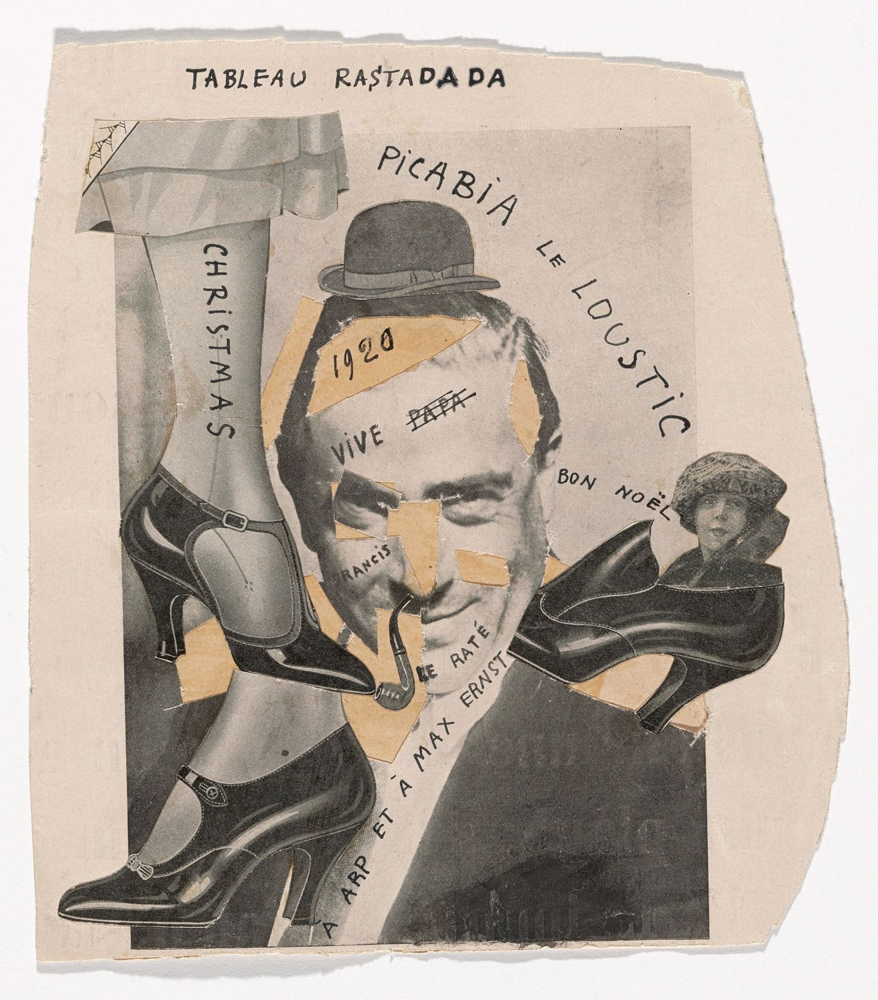

## 基本信息

- 作者：[[毕卡比亚 Francis Picabia]]
- 创作年代：1920
- 材质：纸面拼贴 / 印刷照片 (*not from wiki*)
- 尺寸：约 19 × 17 cm (*not from wiki*)
- 现存地：纽约现代艺术博物馆 MoMA (*not from wiki*)

## 画面与技法

[[毕卡比亚 Francis Picabia]] **达达无厘头期**作品——一张早期[[拼贴 Collage]]作品，包括毕卡比亚本人及一群达达友人的剪贴照片。标题 "Ra$tadada" 中嵌入 $ 符号——"rastaquouère" 在法语中指"靠投机暴发的拉美阔佬 / 暴发户"——毕卡比亚以此自嘲自己古巴—西班牙—法兰西混血的"花花公子"身份。

## 历史背景

(*not from wiki*) 1920 年正值巴黎达达全盛——一战后查拉、布勒东、杜尚、毕卡比亚都回到巴黎，毕卡比亚家成为达达总部。

## 图片清单

| 编号 | 出自 | 描述 |
|---|---|---|
| 01 | [[091｜毕卡比亚：如何用绘画表现达达主义？]] | 整体图 — 照片拼贴 / Ra$tadada 自嘲 |

## 出现在

- [[091｜毕卡比亚：如何用绘画表现达达主义？]]
