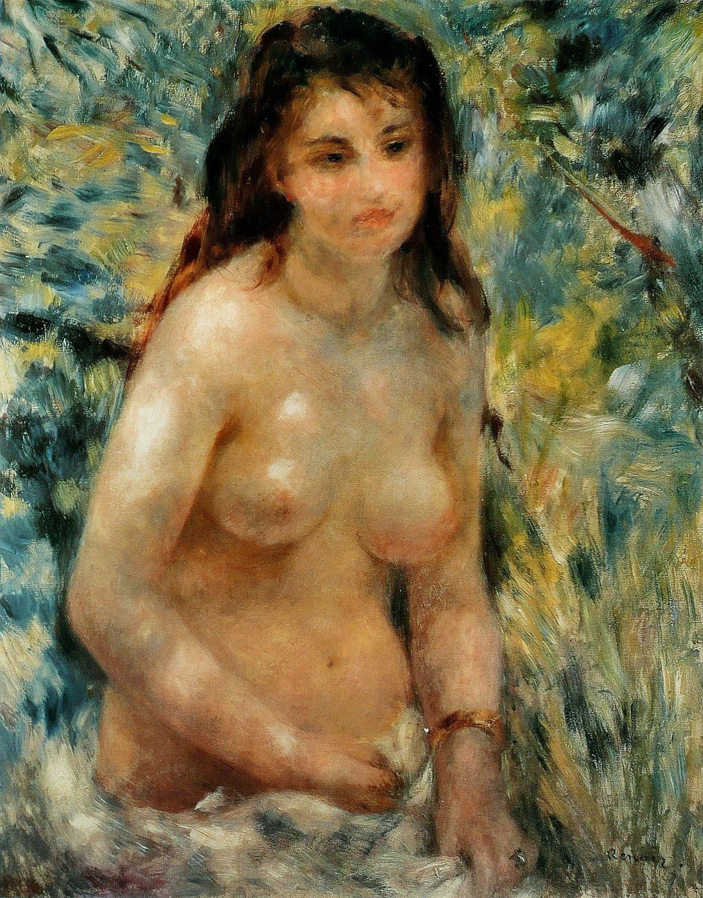

## 基本信息

- 作者：[[雷诺阿 Pierre-Auguste Renoir]]
- 创作年代：1876
- 材质：布面油画 (*not from wiki*)
- 尺寸：81 × 65 cm (*not from wiki*)
- 现存地：奥赛博物馆 Musée d'Orsay, Paris (*not from wiki*)

## 画面与技法

1876 年第二届印象派画展雷诺阿的"两头讨好"实验——按传统方式画裸女躯干（人物可读、形体古典），同时展现**阳光透过斑驳树叶洒在人体上的色斑效果**。雷诺阿特意标注"习作"以减压。

043 顾衡复述当时著名恶评："**让我们告诉雷诺阿先生，一个女人的上半身不是一堆腐肉，只有完全腐烂的尸体才会有绿色和紫色的斑点。**"——这条评语此后多次被引为印象派"色彩光斑"画法挑战观看习惯的典型反应，反映出观众对**有色阴影**这一印象派核心创新的不适应。

本作与《[[包厢 The Theatre Box]]》(1874) 构成对照：包厢是收敛、阳光下的裸女是"放手一试"。**结果完全相反**——这次雷诺阿被骂惨了，从此态度更趋保守，**第四届起退出印象派画展**。这是 043 论印象派"失去雷诺阿在风格多样和技法细腻上损失很大"的转折点。

## 历史背景 (*not from wiki*)

1876 年第二届印象派画展，画家经纪人 [[杜朗-吕厄 Paul Durand-Ruel]] 画廊主办。同届莫奈选送《[[穿和服的卡美伊 Madame Monet in Japanese Costume]]》(妥协之作) 卖了 2000 法郎，与雷诺阿走相反路线——莫奈学雷诺阿的妥协赚到钱，雷诺阿学莫奈的实验被骂——两条策略的位置在这一届被互换。

## 图片清单

| 编号 | 出自 | 描述 |
|---|---|---|
| 01 | [[043｜雷诺阿：妥协如何造就大师？]] | 全图，阳光斑驳的女性裸体上半身 |

## 出现在

- [[043｜雷诺阿：妥协如何造就大师？]]
