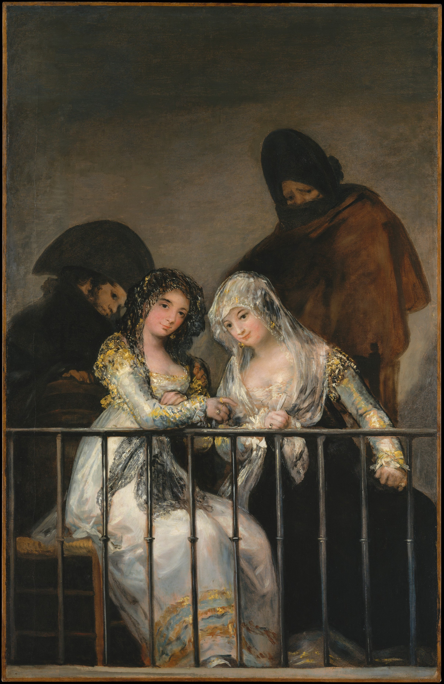

## 基本信息

- 作者：[[戈雅 Francisco Goya]]
- 创作年代：1808–1814
- 材质：布面油画 (*not from wiki*)
- 尺寸：195 × 125.5 cm (*not from wiki*)
- 现存地：纽约大都会博物馆（争议归属版本）/ 另有马德里 Banco Inversión 私人收藏版本 (*not from wiki*)

## 画面与技法

两位身着白衣的西班牙女子（"玛哈" maja 即 18 世纪末西班牙马德里下层女性的时髦装扮）倚靠**阳台栏杆**，身后阴影中站立两位戴帽的男性陪护者。栏杆形成水平切割，前景人物明亮、背景人物隐入暗部——是 [[戈雅 Francisco Goya]] 晚期"明暗双层"构图法的经典样本。

## 在课程中的角色

顾衡 044 明确指出：**[[马奈 Édouard Manet]] 的《[[阳台 The Balcony]]》(1868) 构图直接取自本画**——这是 [[建立绘画的内在传承 Pictorial Self-Reference]] 跨越国境、跨越流派、跨越 60 年的又一典型例证。马奈把戈雅的"两女两男 + 阳台栏杆"几何转化为"三人 + 绿色栏杆"的现代主义压扁版本。

## 历史背景 (*not from wiki*)

属于戈雅晚期"半岛战争"前后的世俗题材。"maja" / "majo" 是 18 世纪末马德里底层青年的时尚社群标签——戈雅作品中多次出现。本画版本至少两幅——大都会版与私人收藏版的归属仍有学术争议。

## 图片清单

| 编号 | 出自 | 描述 |
|---|---|---|
| 01 | [[044｜莫利索和毕沙罗：最纯正的印象派什么样？]] | 全画 |

## 出现在

- [[044｜莫利索和毕沙罗：最纯正的印象派什么样？]] —— 马奈《阳台》构图来源
- [[戈雅 Francisco Goya]] —— 本 wiki 涉及代表作
- [[阳台 The Balcony]] —— 马奈作品的图像母题来源
