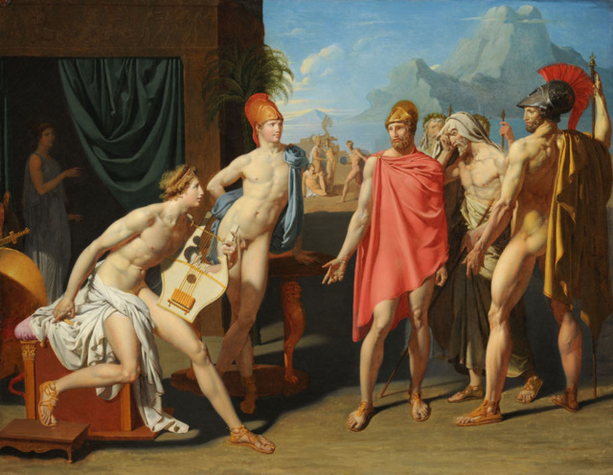

## 基本信息

- 作者：[[安格尔 Jean-Auguste-Dominique Ingres]]
- 创作年代：1801
- 材质：布面油画 (*not from wiki*)
- 尺寸：(*not from wiki*)
- 现存地：(*not from wiki*) 巴黎国家高等美术学院 (École nationale supérieure des Beaux-Arts)

## 画面与技法

古典史诗题材——题材取自《伊利亚特》：阿伽门农派使者前往阿喀琉斯帐篷请其重返战斗 (*not from wiki*)。构图严谨、人物站位古典、线条精准——典型的 [[新古典主义 Neoclassicism]] **罗马奖样板**。

## 历史背景

(*not from wiki*) 1801 年，21 岁的安格尔以本作获**法兰西美术学院 [[罗马奖 Prix de Rome]]**，公费留学罗马。**罗马奖得主必须以历史和神话作品起步**——本作正是这一制度规定下的典型早期作品。但旋即因法国政局动荡，安格尔留学的盘缠迟迟发不下来，他不得不在意大利靠画肖像谋生——日后成为一流肖像画家正与这段经历分不开。

## 图片清单

| 编号 | 出自 | 描述 |
|---|---|---|
| 01 | [[032｜安格尔：为什么他是学院派最后一位大师？]] | 整体画面 |

## 出现在

- [[032｜安格尔：为什么他是学院派最后一位大师？]]
