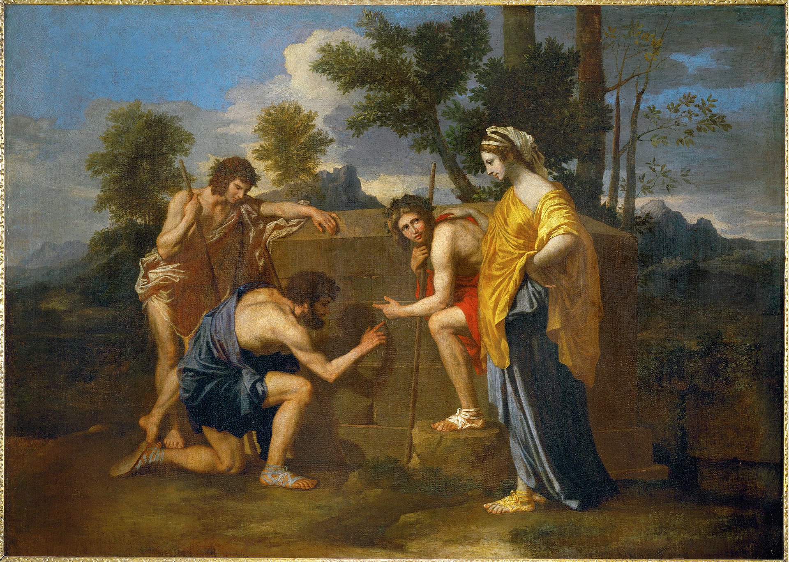

## 基本信息

- 作者：[[普桑 Nicolas Poussin]]
- 创作年代：1637–1638
- 材质：布面油画 (*not from wiki*)
- 尺寸：85 × 121 cm (*not from wiki*)
- 现存地：巴黎卢浮宫 Musée du Louvre (*not from wiki*)

## 画面与技法

四位身着古典服饰的牧人聚集在田园中的一座石棺旁——其中一人跪下，用手指描摹石棺上的拉丁铭文 "**Et in Arcadia ego**"（"即使在阿卡迪亚也有我"——"我"即死神，意为田园乐土里同样有死亡的存在）。右侧女子安静伫立，左手抚在跪地牧人肩上。

- **构图**：水平静态——延续 [[拉斐尔 Raphael]] 的"静、平面、线条"原则
- **氛围**：田园 + 沉思 + 节制——古典主义的典范

## 顾衡解读（030）

> 我们看他的这幅《阿卡迪亚牧人》，**画风和拉斐尔简直是如出一辙**。

被顾衡用作"喝过洋墨水的法国画家在意大利学拉斐尔路线"的样板——是 [[新古典主义 Neoclassicism]] 的**前史样本**。

**为什么普桑死后 100 年突然在法国又火起来**：因为启蒙运动出来了。启蒙运动弘扬理性，普桑学的是拉斐尔，搞的是"让美可测量"——这下子合上了。[[伏尔泰 Voltaire]] 和 [[狄德罗 Denis Diderot]] 这些文人**天天骂 [[布歇 François Boucher]] 是庸才，夸普桑是天才**——拉斐尔派在法国学院派内部的复古路线由此成势。

## 历史背景

(*not from wiki*) 普桑长居罗马，本画为意大利红衣主教 Rospigliosi（后来的教宗 Clement IX）订制；后由路易十四收购入皇家收藏。"Et in Arcadia ego" 的解读自帕诺夫斯基 1936 论文之后成为经典图像志案例（"墓中的死神"对"我曾经也活在阿卡迪亚"的双重解读）。

## 图片清单

| 编号 | 出自 | 描述 |
|---|---|---|
| 01 | [[030｜新古典主义：为什么绘画再次转向宏大叙事？]] | 整体图 |

## 出现在

- [[030｜新古典主义：为什么绘画再次转向宏大叙事？]]
