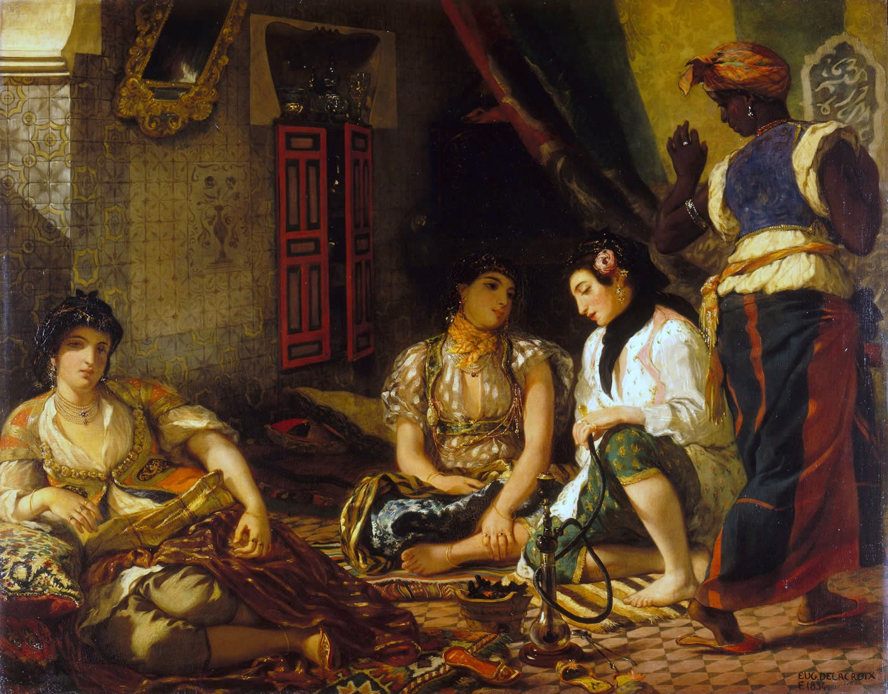

## 基本信息

- 作者：[[德拉克罗瓦 Eugène Delacroix]]
- 创作年代：1834
- 材质：布面油画 (*not from wiki*)
- 尺寸：(*not from wiki*) 180 × 229 cm
- 现存地：(*not from wiki*) 巴黎卢浮宫

## 画面与技法

(*not from wiki*) 阿尔及尔后宫一角：三位**穆斯林女子**坐于地毯之上，水烟、丝绸、镶嵌瓷砖、深褐光影；右侧黑人女仆从画外转身退出。**色彩派的浓郁内敛**——红、金、蓝在低光中互相呼应——构图静止、几乎没有事件。这是德拉克罗瓦 **1832 年北非之行**（陪同法国外交使团赴摩洛哥）的直接产物。

## 历史背景

(*not from wiki*) 1830 年法国占领阿尔及尔——这给了浪漫主义画家**亲身踏入伊斯兰东方**的政治通道。德拉克罗瓦得以**真的进入阿尔及尔的内房**——这在当时的欧洲艺术家中极为罕见。1834 沙龙首展。

## 在课程中的角色

顾衡 034 把本画作为**德拉克罗瓦"回避政治、求助东方气息"的代表作**——但**作了一句对照判决**：

> 同样的东方题材，我们今天记住的却是 [[安格尔 Jean-Auguste-Dominique Ingres]] 的 [[大宫女 The Grand Odalisque]]，而不是德拉克罗瓦的 [[阿尔及利亚女人 Women of Algiers in their Apartment]]。

**对德拉克罗瓦的隐含批评**：在激情和自由的口号下，他**颠覆了传统绘画几乎所有的条例**，但**并没有找到属于自己独特的艺术语言**——东方题材落到他手里也敌不过**安格尔的线条派宫女**。"对于这一点，德拉克罗瓦是心知肚明的。"

## 图片清单

| 编号 | 出自 | 描述 |
|---|---|---|
| 01 | [[034｜德拉克罗瓦：为什么他成了浪漫主义的旗手？]] | 全画 |

## 出现在

- [[034｜德拉克罗瓦：为什么他成了浪漫主义的旗手？]] —— 与安格尔《大宫女》对照的东方题材作
