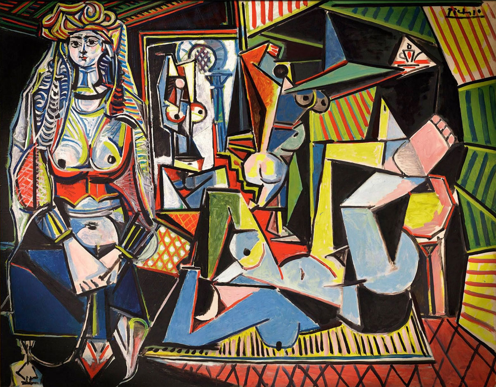

## 基本信息

- 作者：[[毕加索 Pablo Picasso]]
- 创作年代：1954–1955（系列 A–O 共 15 件） (*not from wiki*)
- 材质：布面油画 (*not from wiki*)
- 尺寸：114 × 146 cm (*not from wiki*)
- 现存地：私人收藏（卡塔尔王室） (*not from wiki*)

## 画面与技法

[[毕加索 Pablo Picasso]] 在 1954–1955 年间以"阿尔及尔女人"为母题创作了 15 件变奏（编号 A–O），是对 [[德拉克罗瓦 Eugène Delacroix]] 的 [[阿尔及利亚女人 Women of Algiers in their Apartment]] (1834) 的**致敬与重写**。本作 **Version O** (最终版) 是系列中最完整、最复杂的一幅。

顾衡 078 仅作为对照物提及：截至 2021 年，**绘画作品拍卖价第二名**——**1.79 亿美元**（2015 年纽约佳士得）。

## 历史背景 (*not from wiki*)

2015 年 5 月在纽约佳士得"展望与回望"专场以 1.79 亿美元成交（含佣金），曾短暂刷新世界纪录、后被 [[救世主 (达·芬奇) Salvator Mundi]] 超越。买家被披露为卡塔尔前首相 HBJ。

## 图片清单

| 编号 | 出自 | 描述 |
|---|---|---|
| 01 | [[078｜莫迪里阿尼：画中女子为什么让人一眼难忘？]] | 立体主义变奏（Version O） |

## 出现在

- [[078｜莫迪里阿尼：画中女子为什么让人一眼难忘？]]（作为拍卖价对照——本课主角 [[侧卧的裸女 (莫迪里阿尼) Reclining Nude]] 排第三）
