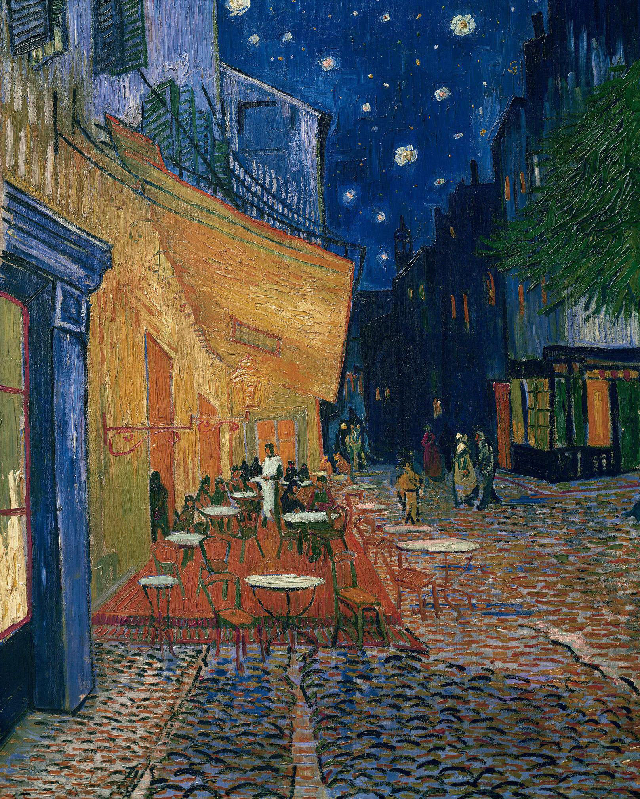

## 基本信息

- 作者：[[凡·高 Vincent van Gogh]]
- 创作年代：1888（顾衡 059 标注 1889）
- 材质：布面油画 (*not from wiki*)
- 尺寸：81 × 65.5 cm (*not from wiki*)
- 现存地：奥特洛 Kröller-Müller Museum (*not from wiki*)

## 画面与技法

阿尔时期夜景的代表作。铬黄咖啡馆灯光对群青夜空 + 鹅卵石路面对斜透视。凡·高首次系统化"以纯色直接表现夜晚"——他写信给提奥说"夜晚比白天更有色彩"。

## 历史背景 (*not from wiki*)

实景位于阿尔市集广场 Place du Forum，现已被改建为致敬咖啡馆。

## 图片清单

| 编号 | 出自 | 描述 |
|---|---|---|
| 01 | [[059｜凡·高3：他为什么走向毁灭？]] | 夜景咖啡馆露台 |

## 出现在

- [[059｜凡·高3：他为什么走向毁灭？]]
