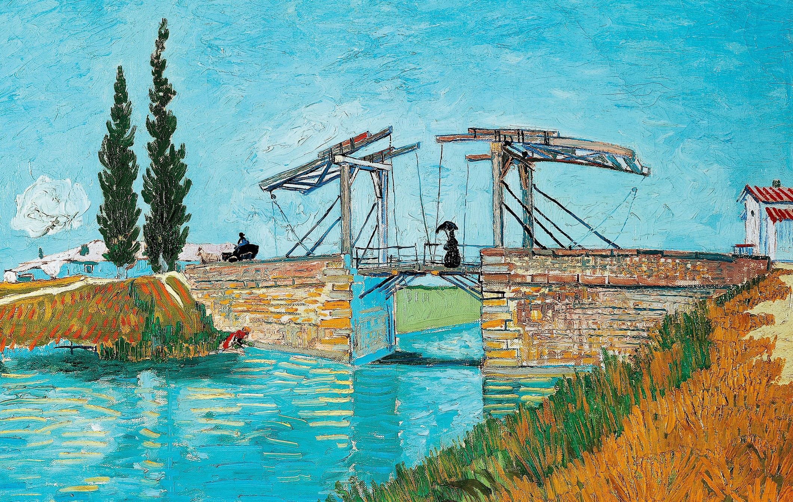

## 基本信息

- 作者：[[凡·高 Vincent van Gogh]]
- 创作年代：1888
- 材质：布面油画 (*not from wiki*)
- 尺寸：(*not from wiki*) 多版本，主版本 54 × 65 cm
- 现存地：(*not from wiki*) 主版本藏于荷兰奥特洛 Kröller-Müller 博物馆

## 画面与技法

058 中顾衡用以举证凡·高吸收**浮世绘**的样板画——"**浓浓的浮世绘风扑面而来**"：

- 简化的轮廓线 + 平涂大色块
- 黄与紫的补色对比——紫为日本皇家专用色、黄为紫的补色且明度最高，从此"具有装饰性"成为凡·高画面的辨识特征
- 河水、桥架、岸边人物等几何元素之间的关系，是日本浮世绘版画构图原则的直接迁移

这是 058 列出的"凡·高偏离印象派的第二点（浮世绘元素）"的代表作。

## 历史背景 (*not from wiki*)

1888 年 2 月凡·高离开巴黎抵达南法 [[阿尔勒 Arles]]——他在阿尔勒附近罗讷河支流的运河上发现了一座可活动的木质吊桥（Langlois 桥，以桥工而名），先后画了若干油画与水彩。这是他凭"我要去太阳的国度"南下后第一批成熟"日本式"作品，也是他南法两年高产期的开端。

## 图片清单

| 编号 | 出自 | 描述 |
|---|---|---|
| 01 | [[058｜凡·高2：为什么他的风格难以界定？]] | 整幅画作，浮世绘构图样本 |

## 出现在

- [[058｜凡·高2：为什么他的风格难以界定？]]
