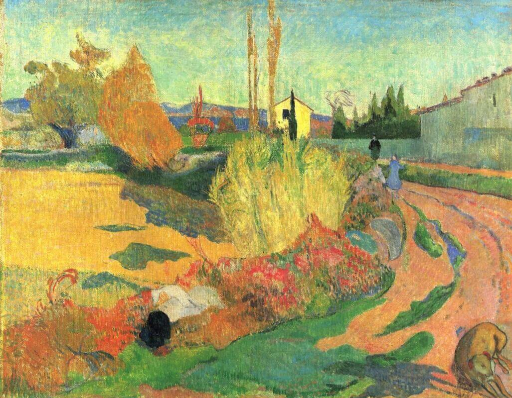

## 基本信息

- 作者: [[高更 Paul Gauguin]]
- 创作年代: 1888
- 材质: 布面油画 (*not from wiki*)
- 尺寸: 信息不全 (*not from wiki*)
- 现存地: 信息不全 (*not from wiki*)

## 画面与技法

- 与 [[阿尔附近的风景 Landscape near Arles]] 同为高更在阿尔 62 天里创作的两幅风景之一。
- 顾衡用这两幅作为高更"**明显是在走印象派的回头路了**"的视觉证据。

## 历史背景 (*not from wiki*)

详见 [[阿尔附近的风景 Landscape near Arles]]。

## 图片清单

| 编号 | 出自 | 描述 |
|---|---|---|
| 01 | [[056｜高更2：象征主义还能走多远？]] | 全图 — 阿尔时期风景 |

## 出现在

- [[056｜高更2：象征主义还能走多远？]]
