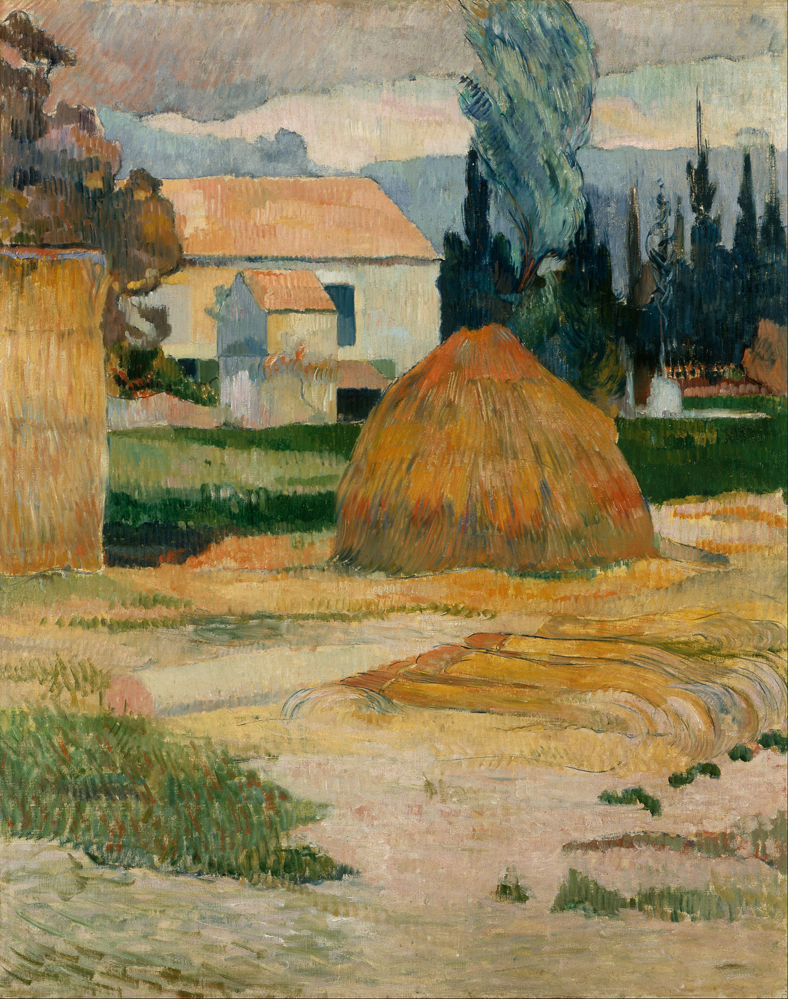

## 基本信息

- 作者: [[高更 Paul Gauguin]]
- 创作年代: 1888
- 材质: 布面油画 (*not from wiki*)
- 尺寸: 年代不详 (*not from wiki*)
- 现存地: 信息不全 (*not from wiki*)

## 画面与技法

- 高更 1888 年在普罗旺斯阿尔与 [[凡·高 Vincent van Gogh]] 同住的 62 天里创作的两幅风景之一。
- 顾衡："**从高更在阿尔期间创作的这两幅风景来看，他明显是在 走印象派的回头路了 。也难怪他心里着急，一天都不想多待。**"
- 与高更同期阿旺桥的 [[综合主义 Synthetism]] 路线形成反差——重新出现破碎笔触、自然光色记录，回到 [[印象派 Impressionism]] 习惯。

## 历史背景 (*not from wiki*)

阿尔时期是高更与凡·高同住的著名 62 天，最终以凡·高割耳事件告终。两人风格差异、争吵升级、精神崩溃的史实材料丰富——本课预告"在介绍凡·高的时候再展开"。

## 图片清单

| 编号 | 出自 | 描述 |
|---|---|---|
| 01 | [[056｜高更2：象征主义还能走多远？]] | 全图 — 阿尔时期风景 |

## 出现在

- [[056｜高更2：象征主义还能走多远？]]
