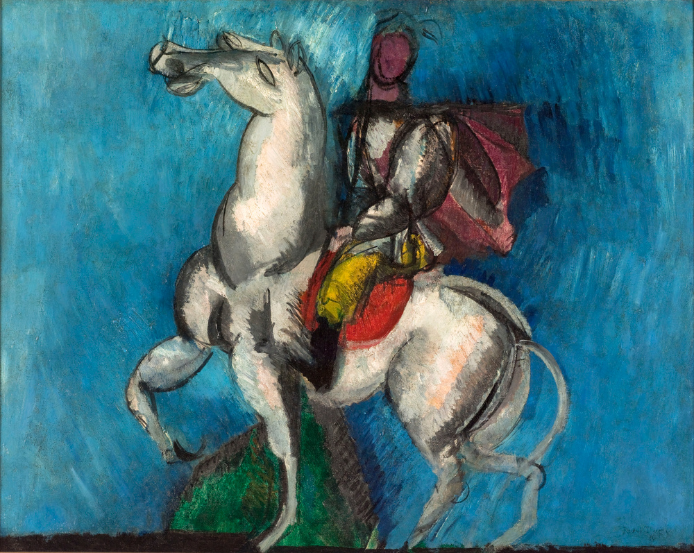

## 基本信息

- 作者：[[杜菲 Raoul Dufy]]
- 创作年代：1914
- 材质：油彩，画布 (*not from wiki*)
- 现存地：(*not from wiki*)

## 画面与技法

[[杜菲 Raoul Dufy]] 1914 年作品。顾衡 063 把本作与 [[帆船赛的回归 The Return of the Regattas]]、[[威尼斯拉多加纳 Venise La Dogana]]、[[海葵 Anemones]]、[[橙色音乐会 The Orange Concert]] 放在一起：

> 不多说了，还是多放几幅杜菲的作品吧。

体现 [[杜菲 Raoul Dufy]] **装饰性+原始性**的稳定风格——明快薄涂色域 + 简率拙朴线条。

## 历史背景 (*not from wiki*)

- 1914 年第一次世界大战爆发；这一时期 [[杜菲 Raoul Dufy]] 已开始稳定地形成自己的装饰画风。
- 阿拉伯/东方题材是 19 世纪以来法国画家持续关注的题材线索 ([[德拉克罗瓦 Eugène Delacroix]]、[[安格尔 Jean-Auguste-Dominique Ingres]] 等)；杜菲以更轻盈、装饰化的方式处理。

## 图片清单

| 编号 | 出自 | 描述 |
|---|---|---|
| 01 | [[063｜野兽派，除了马蒂斯还能谈什么？]] | 整幅画面 |

## 出现在

- [[063｜野兽派，除了马蒂斯还能谈什么？]] —— 顾衡"多放几幅杜菲"5 件之一
