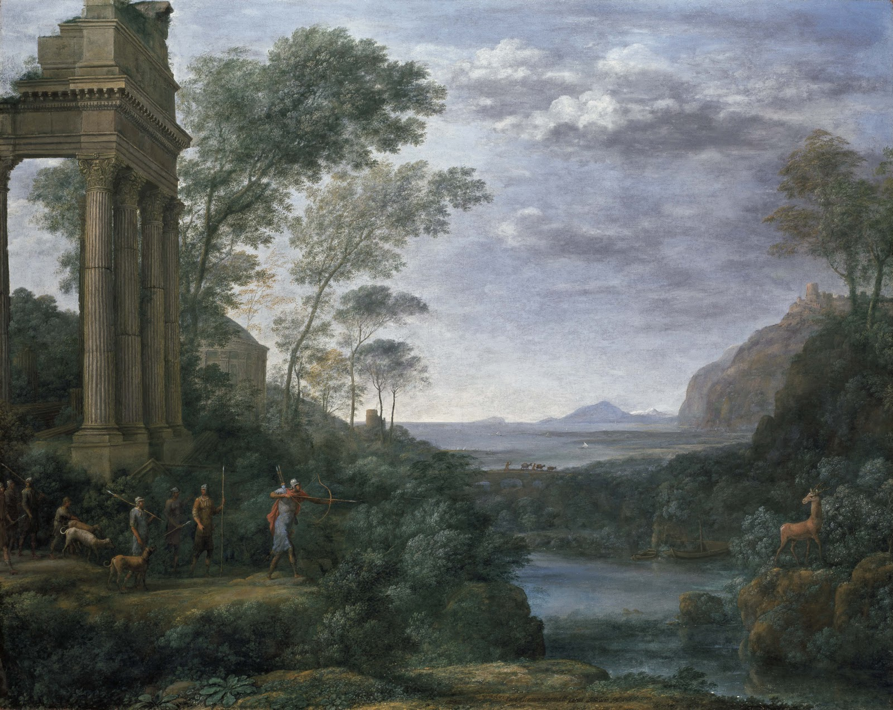

## 基本信息

- 作者：[[洛兰 Claude Lorrain]]
- 创作年代：1682（[[洛兰 Claude Lorrain]] 绝笔之作）
- 材质：布面油画 (*not from wiki*)
- 尺寸：120 × 150 cm (*not from wiki*)
- 现存地：牛津阿什莫林博物馆 (Ashmolean Museum, Oxford) (*not from wiki*)

## 画面与技法

题材取自维吉尔《埃涅阿斯纪》卷七——埃涅阿斯之子**阿斯卡尼俄斯**误射拉丁国王的牧女西尔维娅心爱的雄鹿，触发拉丁战争。

**顾衡 037 核心论点**：

- 当时**教会已经不让画希腊神话裸体女人**——画圣母回家还要每次划十字念"万福马利亚"，"也够累的"
- 同时**风景画**在画家五等里**只比静物高级一点**——拿不上台面
- **洛兰的解法**：**仍然取材神话和圣经故事，但是把人画得小小的**——名字叫个神话故事，**其实不就是风景画吗？**
- 本作就是典型——画名是"阿斯卡尼俄斯猎鹿"，但**人物占画面 5% 不到，95% 是金色光线下的森林、远山、神庙**
- 这种**用神话外衣画风景**的策略**直接启发了 200 年后的 [[巴比松画派 Barbizon School]]**——只是巴比松不再需要外衣

**形式上**：

- **金色调统一光线**——洛兰晚期标志：所有景物笼罩在地中海般温暖的逆光中
- 构图**三段式**：前景大树（repoussoir）/ 中景神庙与人物 / 远景平原与远山——后世风景画家的范式

## 历史背景

(*not from wiki*) 由 Roman 红衣主教 Falconieri 委托，洛兰临终前完成。所有洛兰晚期作品都有 _Liber Veritatis_（真实之书）里的速写副本以防伪——本作也不例外。19 世纪英国大藏家 William Beckford 收藏，后入阿什莫林。

## 图片清单

| 编号 | 出自 | 描述 |
|---|---|---|
| 01 | [[037｜为什么说古典时代没有风景画？]] | 整体图（神话人物 + 大面积金色风景） |

## 出现在

- [[037｜为什么说古典时代没有风景画？]]
