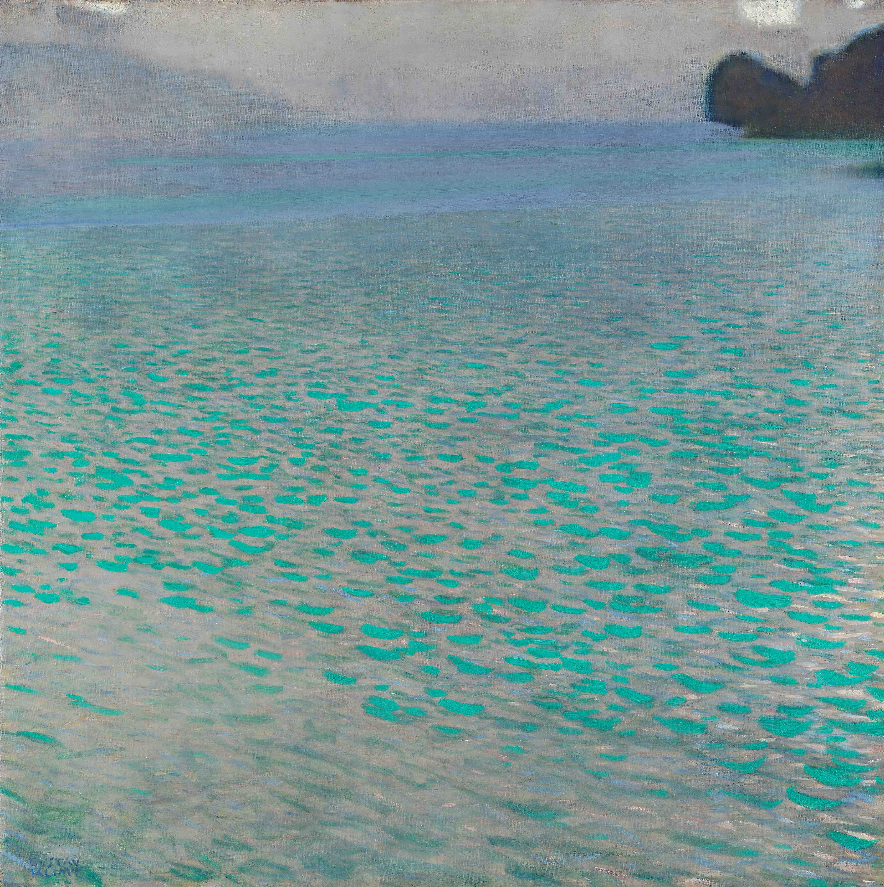

## 基本信息

- 作者：[[克里姆特 Gustav Klimt]]
- 创作年代：1902
- 材质：（*not from wiki*）布面油画
- 尺寸：（*not from wiki*）约 100 × 100 cm
- 现存地：（*not from wiki*）私人收藏

## 画面与技法

[[克里姆特 Gustav Klimt]] **向现代绘画转型尝试**期间的作品——与 [[花园 Blumengarten (克里姆特)]] 同期，明显**体现出 [[印象派 Impressionism]] 的技术特点**（顾衡 073）。

近似无地平线的方形构图、覆盖大面积水面，是克里姆特湖景系列的典型语汇（*not from wiki*）。

## 历史背景 (*not from wiki*)

阿特湖 Attersee 是奥地利萨尔茨卡默古特地区的湖泊，克里姆特和 [[艾米莉·弗洛奇 Emilie Flöge]] 自 1900 年起几乎每年夏天在湖畔度假——风景画系列均出于此时。

## 图片清单

| 编号 | 出自 | 描述 |
|---|---|---|
| 01 | [[073｜克里姆特：什么是维也纳分离派？]] | 阿特湖中的小岛 |

## 出现在

- [[073｜克里姆特：什么是维也纳分离派？]]
