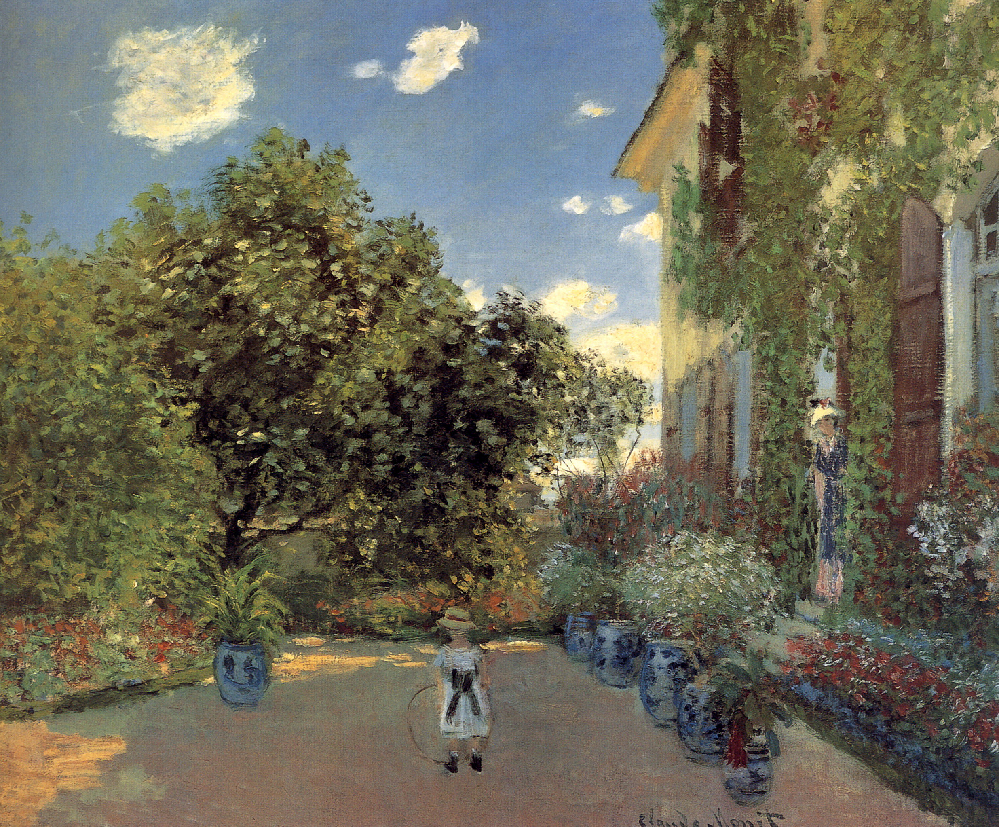

## 基本信息

- 作者：[[莫奈 Claude Monet]]
- 创作年代：1873
- 材质：布面油画 (*not from wiki*)
- 尺寸：60.2 × 73.3 cm (*not from wiki*)
- 现存地：芝加哥艺术博物馆 (*not from wiki*)

## 画面与技法

阿让特伊住宅前的花园景象——前景是莫奈儿子让·莫奈、母亲卡美伊立于门廊；红蓝条纹陶花瓶散布在花床间。

042 顾衡：与《[[阿让特伊的秋天 Autumn on the Seine at Argenteuil]]》《[[红罂粟 Poppy Field]]》并列，**1871–1874 三年间"印象派绘画的所有技术要求，全部呈现出来，并日渐成熟"** 的关键作品组之一。

笔触特征：

- **马赛克式小笔触**堆积花朵、树叶、墙面
- **白色打底** → 整体亮度高
- **统一光线**（夏日午后）

## 历史背景 (*not from wiki*)

[[莫奈 Claude Monet]] 1871 年搬入阿让特伊小镇——这是他与 [[卡美伊·东西厄 Camille Doncieux]] 婚后、与 [[丢朗-吕厄 Paul Durand-Ruel]] 签固定月费合同后家庭经济一度稳定的时期。1873 年 [[丢朗-吕厄 Paul Durand-Ruel]] 买了莫奈起码 29 幅画，让其当年收入达 12000 法郎（参见 [[丢朗-吕厄 Paul Durand-Ruel]] 页）。

## 图片清单

| 编号 | 出自 | 描述 |
|---|---|---|
| 01 | [[042｜莫奈2：《日出·印象》是不是印象派作品？]] | 全画：阿让特伊住宅前花园，儿子与卡美伊立于门廊 |

## 出现在

- [[042｜莫奈2：《日出·印象》是不是印象派作品？]]
