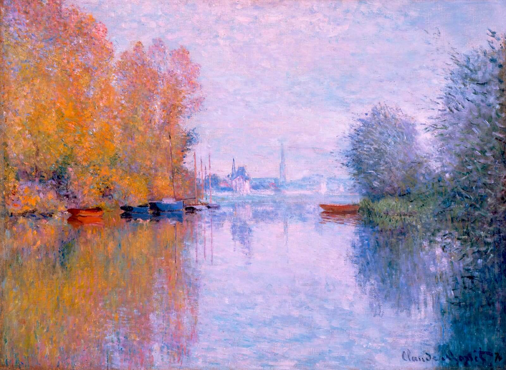

## 基本信息

- 作者：[[莫奈 Claude Monet]]
- 创作年代：1873
- 材质：布面油画 (*not from wiki*)
- 尺寸：约 56 × 75 cm (*not from wiki*)
- 现存地：(*not from wiki*) Courtauld Gallery, London / 私人藏

## 画面与技法

[[莫奈 Claude Monet]] 1871–1874 年阿让特伊时期成熟印象派的代表作之一。塞纳河两岸金黄秋叶映入水中——042 顾衡：

> "**1871 到 1874 这三年，对于莫奈来说是非常关键的三年。我们来看他的《阿让特伊的秋天》《阿让特伊的房子》和《红罂粟》。印象派绘画的所有技术要求，全部呈现出来，并日渐成熟。**"

承载的"印象派绘画的所有技术要求"：

- **户外完成作品**（en plein air）
- **细碎的小笔触**（"逗号或者小圆弧的分离笔触"）
- **统一光线**
- **白色打底带来的整体高亮度**
- **马赛克式色块堆积形体**

## 历史背景 (*not from wiki*)

1871 年 [[莫奈 Claude Monet]] 普法战争结束后回到法国，搬入巴黎西北郊塞纳河边的小镇阿让特伊 (Argenteuil) ——那里也是 1870s 法国划船文化的中心。莫奈在阿让特伊时期与雷诺阿、马奈、卡耶博特等友人频繁互访，形成成熟印象派的群体核心。

## 图片清单

| 编号 | 出自 | 描述 |
|---|---|---|
| 01 | [[042｜莫奈2：《日出·印象》是不是印象派作品？]] | 全画：塞纳河阿让特伊秋季水景 |

## 出现在

- [[042｜莫奈2：《日出·印象》是不是印象派作品？]]
