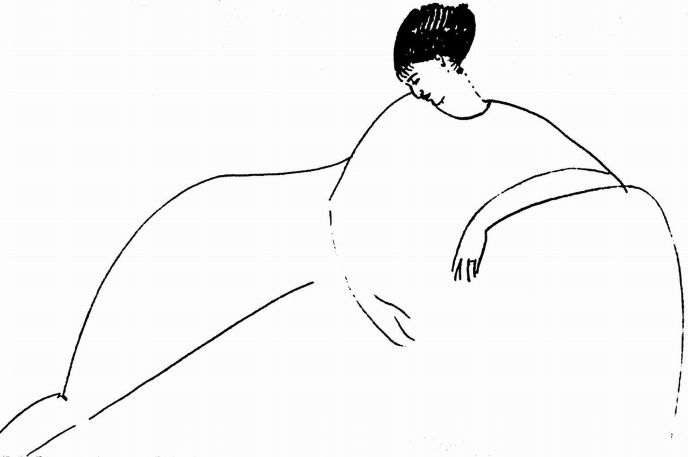

## 基本信息

- 作者：[[莫迪里阿尼 Amedeo Modigliani]]
- 创作年代：1911
- 材质：纸上铅笔素描 (*not from wiki*)
- 尺寸：(*未知*)
- 现存地：(*未知；多件阿赫玛托娃像草图被分散收藏*) (*not from wiki*)

## 画面与技法

[[莫迪里阿尼 Amedeo Modigliani]] 为情人、俄国象征派女诗人 **安娜·阿赫玛托娃** (Anna Akhmatova, 1889–1966) 所作。寥寥几笔——长脖、长鼻、闭合的眼神——已经全部是后来肖像画的标志程式。

顾衡 078 提到：

> 莫迪里阿尼长相俊美，很有女人缘。他长长的情人名单中，还有一位是我们的老熟人，就是俄国女诗人阿赫玛托娃。**阿赫玛托娃 1911 年离开巴黎回国后，两个人的关系就中断了，阿赫玛托娃在回忆录里为此流露过后悔之意。**

## 历史背景 (*not from wiki*)

阿赫玛托娃 1910 年首次与莫迪里阿尼在巴黎相识；1911 年再访巴黎期间二人关系最密切，莫迪里阿尼为她画了约十余幅草图。这些草图直到 1990 年代才在阿赫玛托娃的遗物中陆续被发现。

## 图片清单

| 编号 | 出自 | 描述 |
|---|---|---|
| 01 | [[078｜莫迪里阿尼：画中女子为什么让人一眼难忘？]] | 长颈侧坐素描 |

## 出现在

- [[078｜莫迪里阿尼：画中女子为什么让人一眼难忘？]]
