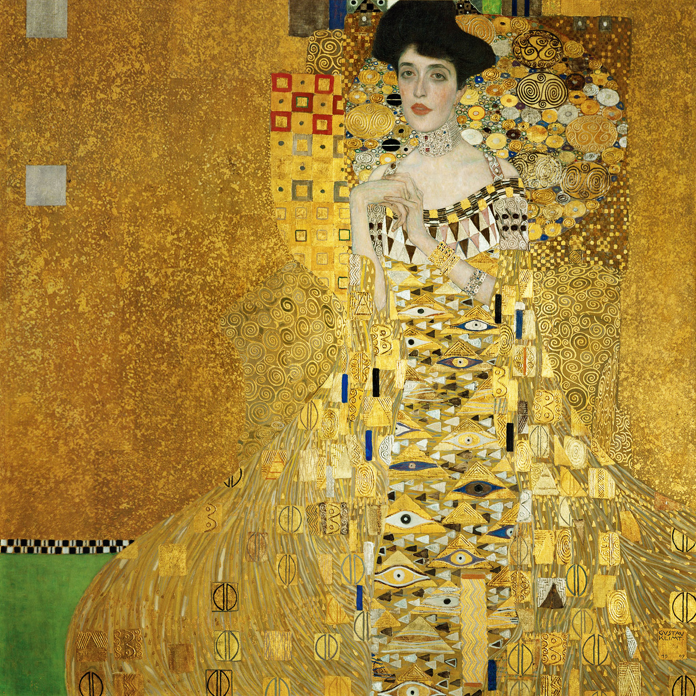

## 基本信息

- 作者：[[克里姆特 Gustav Klimt]]
- 创作年代：1907
- 材质：（*not from wiki*）布面油画、金箔、银箔
- 尺寸：（*not from wiki*）138 × 138 cm
- 现存地：（*not from wiki*）纽约 Neue Galerie

## 画面与技法

[[克里姆特 Gustav Klimt]] **成熟风格的杰出代表**（顾衡 073）：

- **人物的神情和姿势**——仍然是 [[惠斯勒 James Whistler]] 式（参 [[白衣少女 The White Girl (惠斯勒)]]）
- **金箔大量铺设**——出自克里姆特金匠之子的本能
- **借用拜占庭和阿拉伯的几何图形**——营造奇妙的装饰效果
- **东方元素**：这极大地迎合了当时人们对**东方元素**的想象和喜爱——正是 [[新艺术运动 Art Nouveau]] "拥抱欧外艺术"理论的视觉兑现

技术嫁接点 = 惠斯勒姿态 + 拜占庭 / 阿拉伯几何 + 金箔工艺（[[拜占庭艺术 Byzantine Art]] 金底圣像 + 伊斯兰几何织毯的合成）。

## 历史背景 (*not from wiki*)

- 模特阿黛尔·布洛赫-鲍尔 Adele Bloch-Bauer 是维也纳富裕犹太家族的女主人
- 1938 年纳粹强占；2006 年美国最高法院判决归还，被纽约 Ronald Lauder 以 1.35 亿美元购入 Neue Galerie——史上拍卖纪录之一
- 同名传记电影《金衣女人》Woman in Gold（2015）

## 图片清单

| 编号 | 出自 | 描述 |
|---|---|---|
| 01 | [[073｜克里姆特：什么是维也纳分离派？]] | 阿黛尔夫人像（金箔成熟风格） |

## 出现在

- [[073｜克里姆特：什么是维也纳分离派？]]
