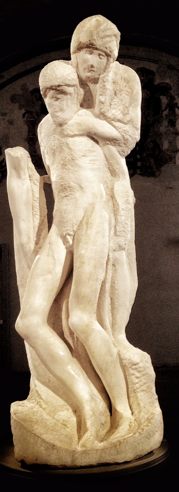

## 基本信息

- 作者：[[米开朗基罗 Michelangelo]]
- 创作年代：1549–1564 (临死前还在反复修改) (*not from wiki*)
- 材质：大理石
- 尺寸：高 195 cm (*not from wiki*)
- 现存地：意大利米兰斯福尔扎城堡 (Castello Sforzesco, Milano)

## 画面与技法

**圣母与基督呈现极端简化、近乎抽象的形态**——圣母站立靠在基督身后，两人的身体几乎融为一体；基督的腿模糊地垂下，圣母的脸只勾出几条线；右侧仍可见米开朗基罗**早期版本的基督手臂**——他没把它完全凿掉，留作"过去自我"的痕迹。

形式特征：

- **彻底抛弃写实**——这是 [[米开朗基罗 Michelangelo]] 晚年自觉的 [[未完成性 Non-finito]] 探索；
- **垂直构图**——两人的身体合并成一根垂直的柱状，与早期 [[圣母怜子 (米开朗基罗) Pietà]] (1499) 的金字塔构图形成鲜明对照；
- **粗糙凿痕**——石面上的工具痕被刻意保留，没有打磨抛光；
- **"留白"效果**——观众面对未完成作品会调动想像力参与，比"完美无缺"更有感染力。

顾衡 012："据说，米开朗基罗临死的时候，还在反复修改这个作品。这件抛弃写实、专注于风格探索的作品，也对后世的艺术家们产生了巨大的影响。"

## 历史背景

(*not from wiki*) 原置于罗马 隆达尼尼宫 (Palazzo Rondanini)，1952 年米兰市政府购入。米开朗基罗 74–89 岁期间持续创作；他 89 岁去世时这件作品仍在他工作室里。

20 世纪现代雕塑家把它认作"现代雕塑的源头"——罗丹、布朗库西、贾科梅蒂都从中汲取过 (*not from wiki*)。

## 图片清单

| 编号 | 出自 | 描述 |
|---|---|---|
| 01 | [[012｜米开朗基罗：他为什么能被艺术史家"封神"？]] | 整体图 |

## 出现在

- [[012｜米开朗基罗：他为什么能被艺术史家"封神"？]]
