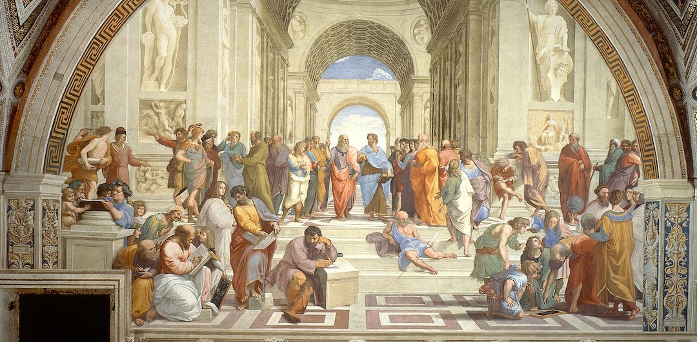
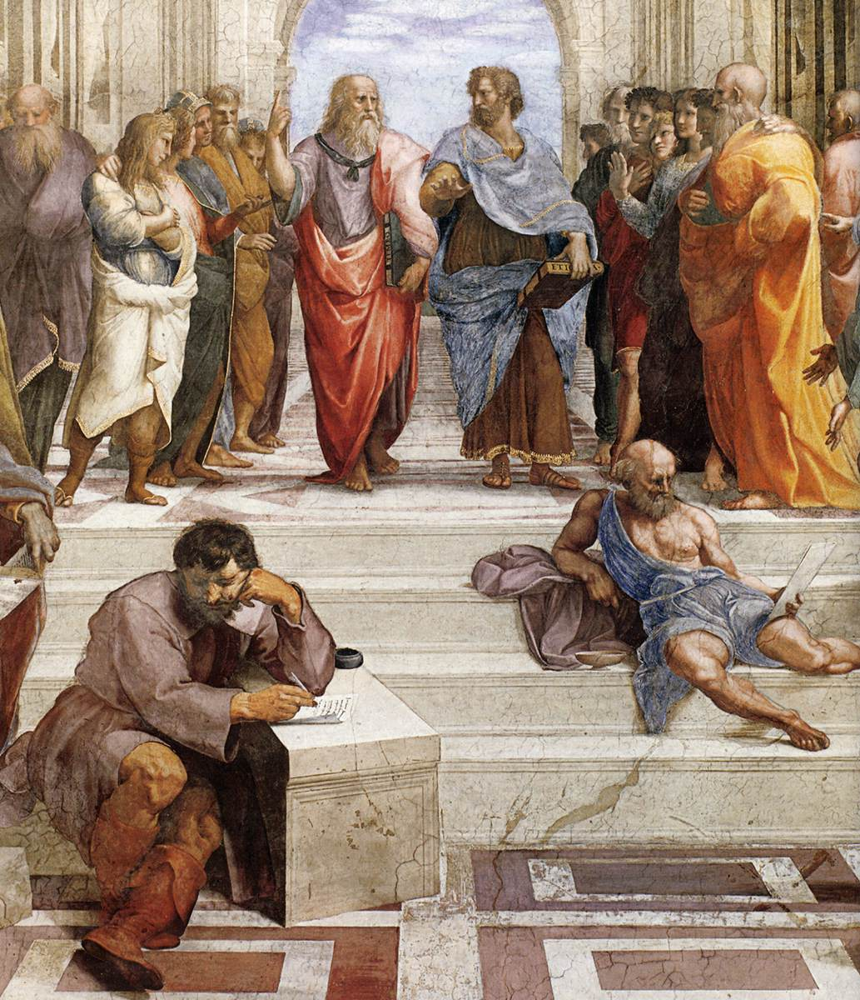
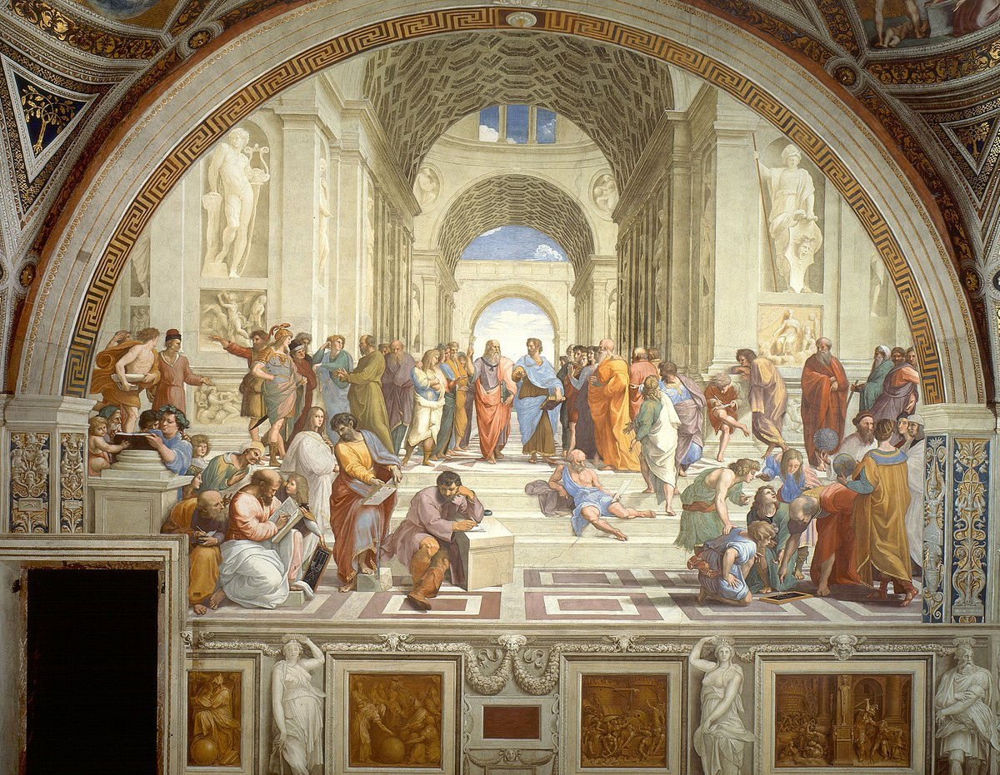
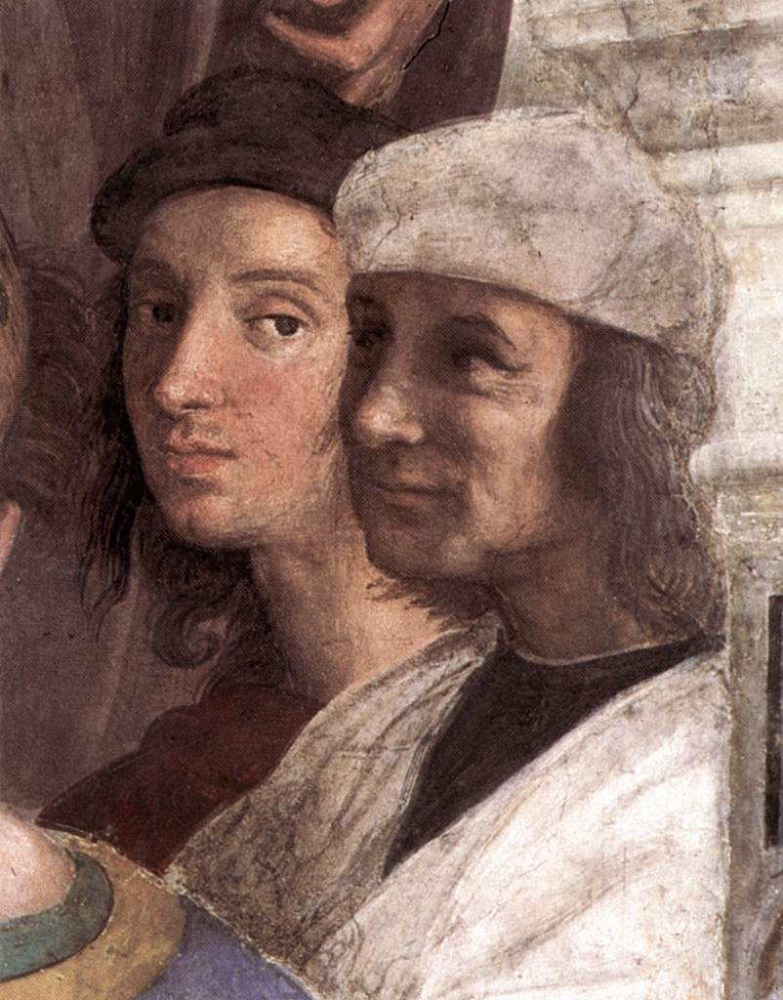
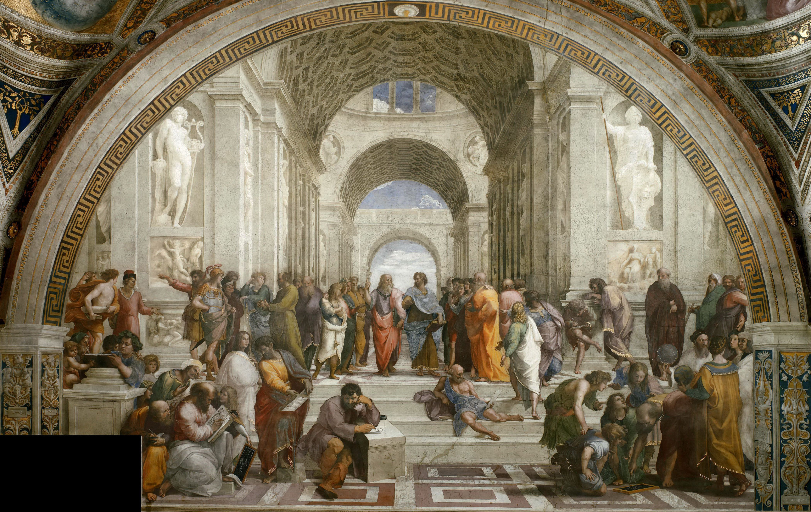
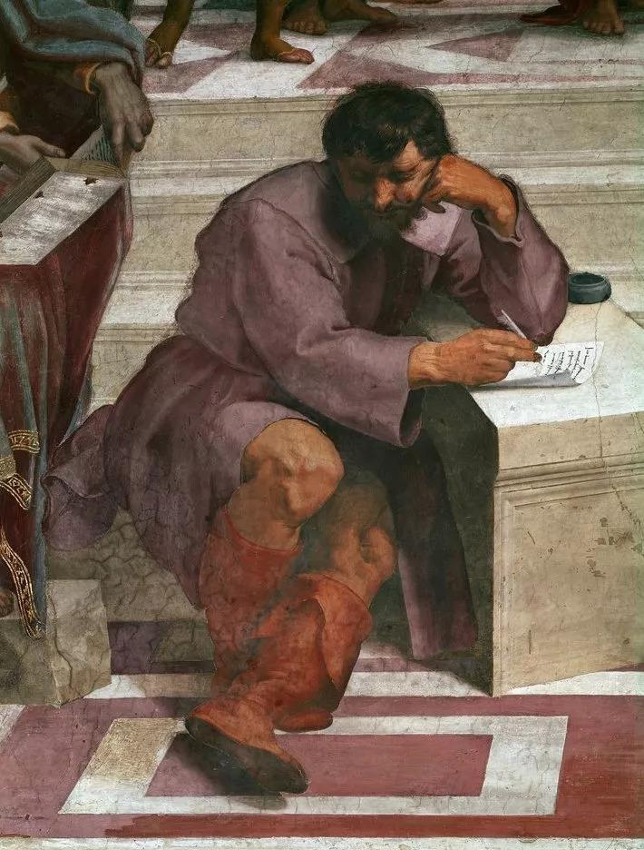

## 基本信息

- 作者：[[拉斐尔 Raphael]]
- 创作年代：1509–1510 (*not from wiki*)
- 材质：壁画 (fresco)
- 尺寸：500 × 770 cm (*not from wiki*)
- 现存地：梵蒂冈宫"签字大厅" (Stanza della Segnatura, Palazzi Pontifici, Vaticano)

## 画面与技法

大型半圆拱廊空间——画面纵深由 [[线性透视 Linear Perspective]] 严格建构，消失点设在画面中央两位主角之间。

- **中央**：柏拉图（手指天）与亚里士多德（手按地）——两人占据画面焦点；
- **环绕**：57 位古希腊哲学家与科学家——苏格拉底、毕达哥拉斯、赫拉克利特（沉思的米开朗基罗）、欧几里得（弯腰丈量的布拉曼特）、第欧根尼（卧于阶上）……
- **拉斐尔将同时代人面孔嵌入古哲身上**——画面右下角自画像（戴黑帽侧首望向观众）、赫拉克利特画成米开朗基罗、欧几里得画成布拉曼特。
- 构图严格对称，建筑空间宏大；用色克制但层次丰富。

## 历史背景

(*not from wiki*) 教皇 尤利乌斯二世 命拉斐尔绘梵蒂冈宫"签字大厅"四面壁画，每面对应一个知识领域：**哲学**（雅典学院）、**神学**（圣餐辩论）、**法学**（三美德）、**诗艺**（帕纳塞斯山）。1509 年 拉斐尔 26 岁开始，1510 年完成。

顾衡用它在 [[007｜文艺复兴是怎么发生的？]] 作为**文艺复兴根本驱动力的视觉宣言**：教皇让拉斐尔在自家会议室的墙上画 57 位**根本不信基督教的古希腊哲学家**——为什么？因为经过阿维尼翁之囚与三教皇闹剧后，**罗马教廷必须把自己装扮成古希腊古罗马文明的继承人**，才能重塑权威。本作正是这一意识形态工程最直白、最自信的画面化身。

## 深度细节（lecture 008 追加）

- **柏拉图（手指天）**：腋下夹《蒂迈欧篇》，强调理念与原型
- **亚里士多德（手指地）**：手持《尼各马可伦理学》，强调知识来源于经验
- **拉斐尔的两个偏向操作**——
  1. 台阶上斜躺的**第欧根尼**挡住亚里士多德去路 → 消极出世对积极入世的诘难
  2. 柏拉图被画成白胡子老头、亚里士多德画成 40 岁中年 → 气势上柏拉图赢
- 据 达尼埃尔·阿拉斯 考证，那张白胡子脸**其实是中世纪流传甚广的亚里士多德形象**——拉斐尔移花接木，暗示新柏拉图主义代替了亚里士多德学说成为正统
- **赫拉克利特** = 画面前方用手拄脸颊的黑发人，用了 [[米开朗基罗 Michelangelo]] 的脸——拉斐尔偷艺西斯廷教堂构图后公开"致敬"，米开朗基罗不解风情，两人闹翻

## 图片清单

| 编号 | 出自 | 描述 |
|---|---|---|
| 01 | [[007｜文艺复兴是怎么发生的？]] | 整体图（CDN 版本 1） |
| 02 | [[008｜文艺复兴到底复兴了什么？]] | 局部：柏拉图与亚里士多德 |
| 03 | [[008｜文艺复兴到底复兴了什么？]] | 整体图（CDN 版本 2，与 01 同作品） |
| 04 | [[011｜拉斐尔：为什么说他是"集大成者"？]] | 局部：拉斐尔自画像（画面最右侧看着观众） |
| 05 | [[011｜拉斐尔：为什么说他是"集大成者"？]] | 整体图（CDN 版本 3） |
| 06 | [[013｜恩怨：文艺复兴三杰如何相互影响？]] | 局部：赫拉克利特（米开朗基罗的脸） |
| 07 | [[018｜矫饰主义：过度追求形式有什么后果？]] | 整体图（与 4 年后《波尔哥火灾》对照：拉斐尔本人未能幸免于米开朗基罗风格） |

## 出现在

- [[007｜文艺复兴是怎么发生的？]]
- [[008｜文艺复兴到底复兴了什么？]]（深度细节解读：柏拉图 vs. 亚里士多德、第欧根尼、阿拉斯考证、米开朗基罗八卦）
- [[011｜拉斐尔：为什么说他是"集大成者"？]]（梵蒂冈四主题之一；拉斐尔自画像在最右侧；签字大厅由教皇尤利乌斯二世独家交给他）
- [[013｜恩怨：文艺复兴三杰如何相互影响？]]（赫拉克利特 = 米开朗基罗的脸，拉斐尔偷艺的视觉证据）
- [[018｜矫饰主义：过度追求形式有什么后果？]]（与 4 年后《波尔哥火灾》对照——拉斐尔本人也未能幸免）
