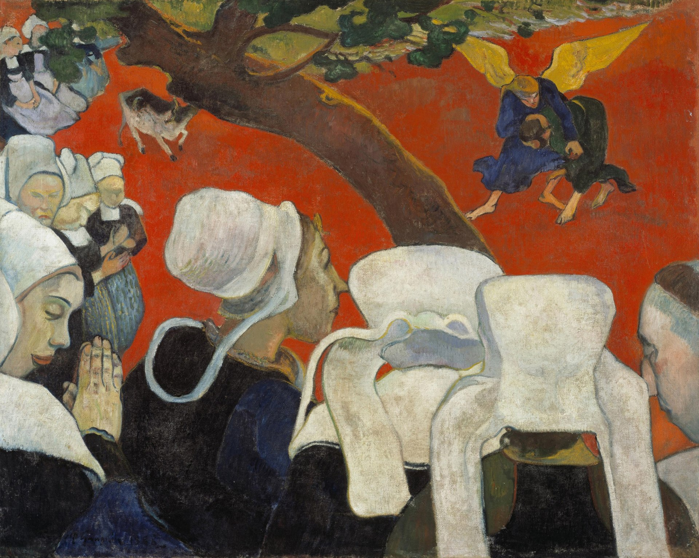

## 基本信息

- 作者: [[高更 Paul Gauguin]]
- 创作年代: 1888
- 材质: 布面油画 (*not from wiki*)
- 尺寸: 73 × 92 cm
- 现存地: 苏格兰国家美术馆，爱丁堡 (*not from wiki*)

## 画面与技法

顾衡 055 给出的高更转折之作——"**以布列塔尼农妇听了布道后产生幻象为由，从构图到透视到色彩的运用，彻底抛弃了先前印象派的理念，而全面转向了主观化**"。

技法特点（055 论述）：

- **景泰蓝派** [[景泰蓝派 Cloisonnism]]：粗黑轮廓线 + 平涂色块
- **大色块对比**：白帽子 + 红土地
- **借树暗示景深**：高更尝试用一棵树作为前后景的分隔线，但顾衡评："**借用一棵树来暗示景深的效果也并不理想。如何不用光与影、只用颜色对比来营造景深——在这一点上，他还有需要向 [[塞尚 Paul Cézanne]] 学习的地方。**"
- **难处理的"红土上的白帽下的农妇脸"**——顾衡明言"农妇脸庞的色彩选择成了一个无法处理的难题"

## 历史背景 (*not from wiki*)

1888 高更画完后与几位朋友把画抬到当地教堂——神父以为是恶作剧、坚决拒收，又抬了回来。此画因此成为**高更从[[印象派 Impressionism]]倒向[[象征主义 Symbolism]]的标志性宣言**，也是[[景泰蓝派 Cloisonnism]]与综合主义的开端样本。

## 图片清单

| 编号 | 出自 lecture | 描述 |
|---|---|---|
| 01 | [[055｜高更1：为什么从印象派走向象征主义？]] | 全图 |

## 出现在

- [[055｜高更1：为什么从印象派走向象征主义？]]
