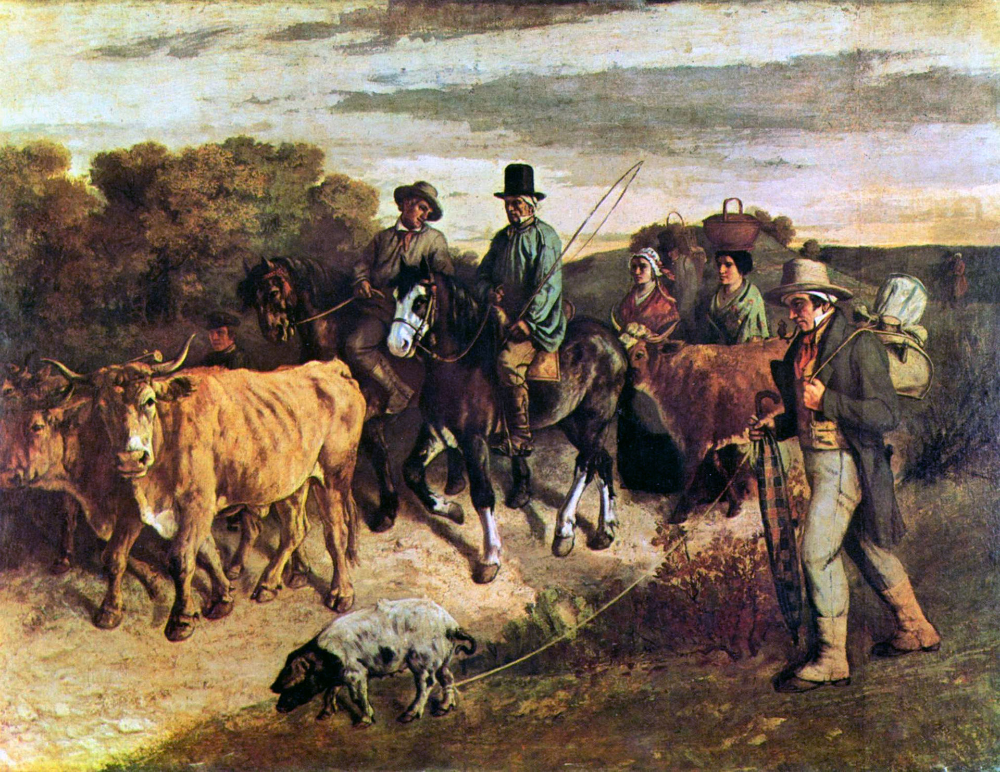

## 基本信息

- 作者：[[居斯塔夫·库尔贝 Gustave Courbet]]
- 创作年代：1855（顾衡 035 caption；多数文献作 1850–1855）
- 材质：布面油画 (*not from wiki*)
- 尺寸：约 206 × 275 cm (*not from wiki*)
- 现存地：贝桑松美术与考古博物馆 Musée des Beaux-Arts et d'Archéologie de Besançon (*not from wiki*)

## 画面与技法

库尔贝家乡奥尔南附近 Flagey 村**几位喝醉了酒的神父**及农民们从集市归来——人物步态摇晃、姿态散漫。**故意挑了"喝醉的神父"作主角**——这是宗教权威 / 道德权威**正面冲击**。

## 历史背景

顾衡 035 明示这是库尔贝唯一一幅创造**双沙龙拒收纪录**的画：

> 库尔贝又故意画了**《集会归来》**，内容是几个喝醉了酒的神父。这下把政府惹恼了。
> 不仅沙龙拒绝了这幅画，**还特意打招呼，[[落选者沙龙 Salon des Refusés]] 也不许收这幅画**。这下子，库尔贝成了**唯一一个作品被两个沙龙拒绝的画家**。

这是 1863 年——同年他《[[猎狐 The Hunted Roe Deer]]》和《[[L夫人肖像 (洛尔·波罗) Portrait of Mme L (Laure Borreau)]]》刚入选官方沙龙——库尔贝**主动**回赠了一记反叛之拳。

(*not from wiki*) 部分文献认为创作起始于 1850 年，多次修订到 1855 / 1863 间。顾衡 035 caption 标 1855 与本作首次展出 / 修订完成期一致。

## 图片清单

| 编号 | 出自 | 描述 |
|---|---|---|
| 01 | [[035｜库尔贝：为什么现实主义的开创者争议那么大？]] | 农民与神父从集市归来场景 |

## 出现在

- [[035｜库尔贝：为什么现实主义的开创者争议那么大？]]
