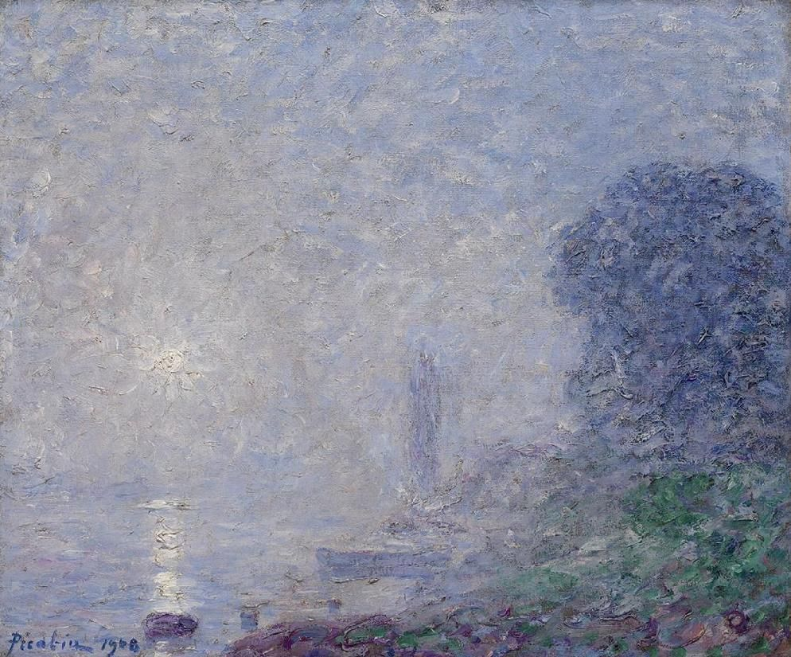

## 基本信息

- 作者：[[毕卡比亚 Francis Picabia]]
- 创作年代：1906
- 材质：布面油画 (*not from wiki*)
- 尺寸：约 73 × 92 cm (*not from wiki*)
- 现存地：私人收藏 (*not from wiki*)

## 画面与技法

[[毕卡比亚 Francis Picabia]] **印象派出道期**的代表——"既有对 [[莫奈 Claude Monet]] 的忠实致敬，也有对 [[毕沙罗 Camille Pissarro]] 的刻意模仿"。卢瓦尔河水面被晨雾蒙住，色调统一在灰蓝—奶白—淡紫之间。

## 历史背景

(*not from wiki*) 当时 [[印象派 Impressionism]] 已被官方和大众接受，"两头讨喜"，再加上毕卡比亚画工好，一出道就大受欢迎。

## 图片清单

| 编号 | 出自 | 描述 |
|---|---|---|
| 01 | [[091｜毕卡比亚：如何用绘画表现达达主义？]] | 整体图 — 灰蓝晨雾笼罩的卢瓦尔河 |

## 出现在

- [[091｜毕卡比亚：如何用绘画表现达达主义？]]
