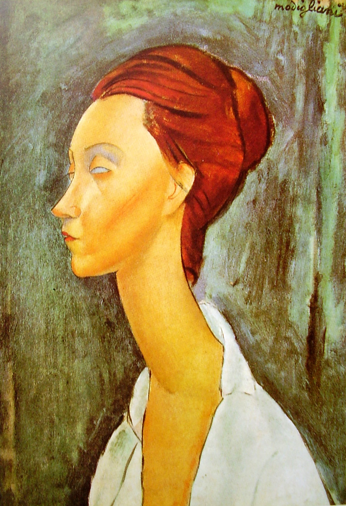

## 基本信息

- 作者：[[莫迪里阿尼 Amedeo Modigliani]]
- 创作年代：1919
- 材质：布面油画 (*not from wiki*)
- 尺寸：(*未知*)
- 现存地：(*未知；多版本散布欧美*) (*not from wiki*)

## 画面与技法

模特露尼娅·捷克沃斯卡 (Lunia Czechowska) 是 [[莫迪里阿尼 Amedeo Modigliani]] 经纪人 Léopold Zborowski 的妻子的好友。莫迪里阿尼为她画了约 14 幅肖像，是其晚期最重要的肖像系列之一。

成熟期标准程式：长鼻、长颈、椭圆头、空白或灰矇的眼睛——顾衡 078 把它与 [[红发女人 (莫迪里阿尼) Woman with Red Hair]]、[[艺术家的妻子 (莫迪里阿尼) The Artist's Wife]] 并列为"无一例外"的程式范本。

## 历史背景 (*not from wiki*)

1919 年莫迪里阿尼健康急剧恶化，但创作仍在继续；露尼娅成为这一年他最频繁的模特。1920 年 1 月他因结核病逝，年仅 35 岁。

## 图片清单

| 编号 | 出自 | 描述 |
|---|---|---|
| 01 | [[078｜莫迪里阿尼：画中女子为什么让人一眼难忘？]] | 露尼娅长颈坐像 |

## 出现在

- [[078｜莫迪里阿尼：画中女子为什么让人一眼难忘？]]
