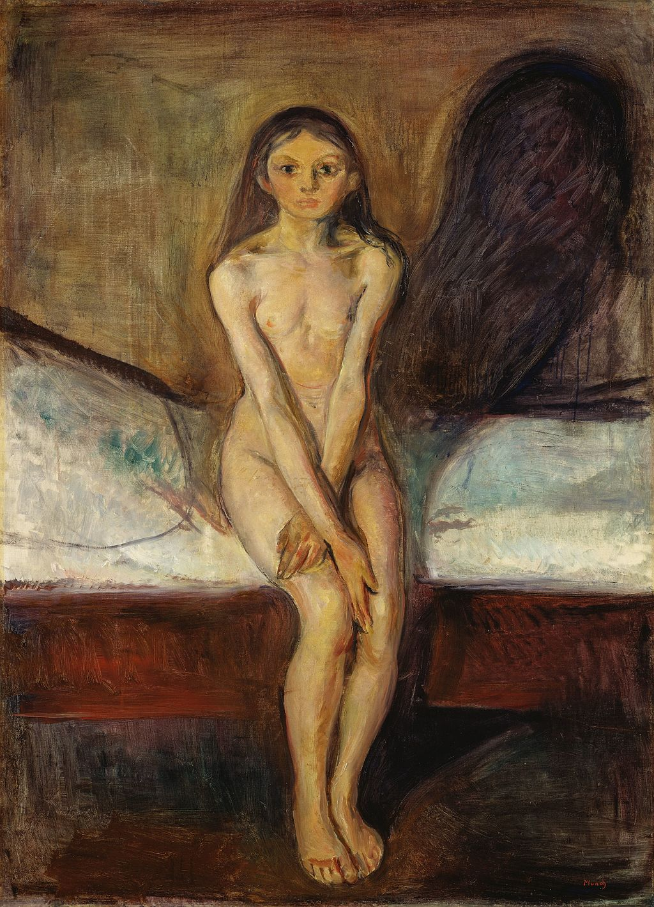

## 基本信息

- 作者：[[爱德华·蒙克 Edvard Munch]]
- 创作年代：1894
- 材质：布面油画 (*not from wiki*)
- 尺寸：约 151 × 110 cm (*not from wiki*)
- 现存地：奥斯陆 挪威国家美术馆 National Museum of Norway, Oslo (*not from wiki*)

## 画面与技法

顾衡 [[071｜蒙克2：为什么他是表现主义之父？]] 解读：

- 少女**瞪大着眼睛**，**左手还沾着一些血迹**。
- 昏暗的灯光在墙上投下了一个**大大的、生殖器形状的阴影**。
- 含义："**纯洁的少女就要变成欲望无度的妇人**，在蒙克看来，这实在是可悲、可恶。"

属蒙克 [[表现主义 Expressionism]] 时期、以"**女人都是坏东西**"为起点系列中的一件。

## 历史背景 (*not from wiki*)

蒙克"生命的饰带" Frieze of Life 系列；同一构图蒙克绘制过多个版本与版画。

## 图片清单

| 编号 | 出自 | 描述 |
|---|---|---|
| 01 | [[071｜蒙克2：为什么他是表现主义之父？]] | 瞪眼少女与墙上阴影 |

## 出现在

- [[071｜蒙克2：为什么他是表现主义之父？]]
