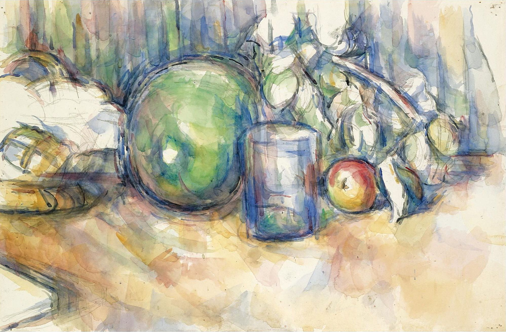

## 基本信息

- 作者：[[塞尚 Paul Cézanne]]
- 创作年代：1906
- 材质：水彩 / 油彩 (*not from wiki*)
- 尺寸：(*not from wiki*) 约 31 × 47 cm
- 现存地：(*not from wiki*) 私人收藏 / 流转

## 画面与技法

[[塞尚 Paul Cézanne]] 去世当年（1906）的静物。顾衡 054 把它与 [[三个梨 Three Pears]] 和 [[苹果和橘子 Apples and Oranges]] 并列，作为水果静物母题的**晚期样本**——同一段引述"晚期水果静物中出现了线条……但塞尚从未背弃用颜色来塑造形体的艺术原则"指向本作。

## 历史背景 (*not from wiki*)

1906 是塞尚生命最后一年（10 月 22 日去世于艾克斯）。晚年作品笔触愈加松弛、颜料愈加透明，水彩比例上升、油彩与水彩界线模糊。本作的青瓜形态简化为接近圆柱体的几何骨骼，是塞尚"球体 / 圆锥体 / 圆柱体"形式公式的直接例证。

## 图片清单

| 编号 | 出自 | 描述 |
|---|---|---|
| 01 | [[054｜塞尚3：为什么理解塞尚那么困难？]] | 全图——去世当年水果静物 |

## 出现在

- [[054｜塞尚3：为什么理解塞尚那么困难？]] —— 水果静物母题的最晚样本
