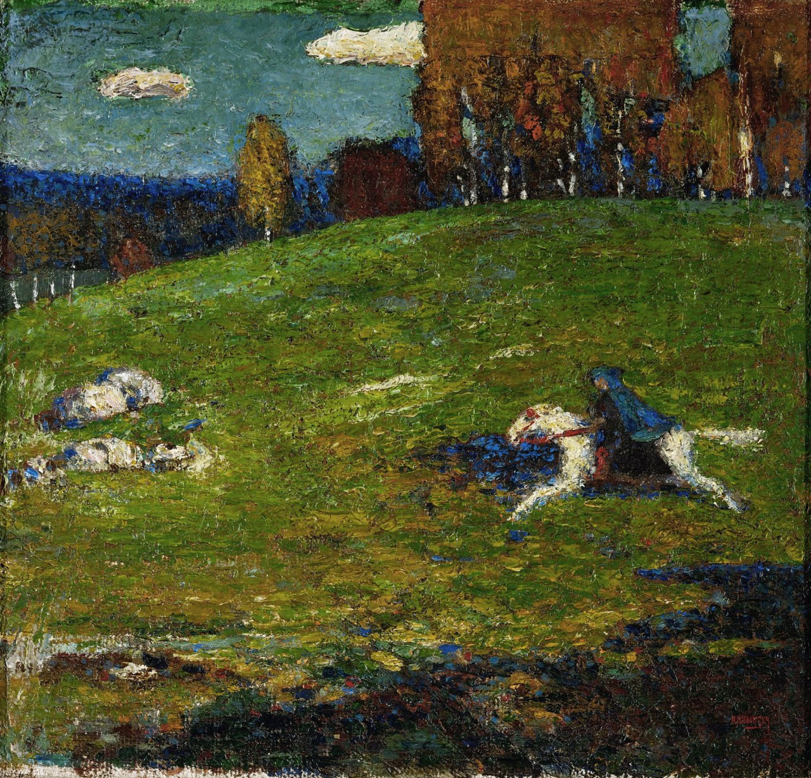

## 基本信息

- 作者：[[康定斯基 Wassily Kandinsky]]
- 创作年代：1903
- 材质：布面油画 (*not from wiki*)
- 尺寸：(*not from wiki*：约 55 × 60 cm)
- 现存地：(*not from wiki*：苏黎世 Bührle 收藏)

## 画面与技法

骑马人小幅风景画，调子明亮、笔触松动。

## 历史背景

康定斯基早年作品，是 [[青骑士 Der Blaue Reiter]] **团体名称的来源**：1911 年他与 [[马尔克 Franz Marc]] 等人在慕尼黑组建团体时，因二人都喜欢马、都喜欢蓝色，恰好康定斯基已经画过这幅《青骑士》，便以此画的名字作为团体名。

## 图片清单

| 编号 | 出自 | 描述 |
|---|---|---|
| 01 | [[081｜康定斯基1：什么是抽象绘画？]] | 蓝衣骑马人在原野上奔驰 |

## 出现在

- [[081｜康定斯基1：什么是抽象绘画？]]
