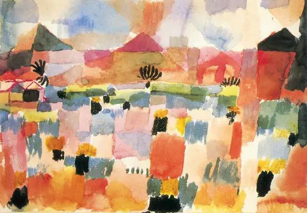

## 基本信息

- 作者：[[克利 Paul Klee]]
- 创作年代：1914
- 材质：水彩 (*not from wiki*)
- 现存地：巴黎·蓬皮杜中心 (*not from wiki*)

## 画面与技法

本讲举例：[[克利 Paul Klee]] **战前作品**的典型面貌——"[[野兽派 Fauvism]] 与 [[立体主义 Cubism]] 的混搭"：规则的几何形状 + 鲜艳的色彩。出自其著名的 1914 年突尼斯之旅（与 [[马克 August Macke]] 同行）。

## 历史背景

(*not from wiki*) 1914 年克利、马克和 Louis Moilliet 同游突尼斯，这是克利艺术生涯的色彩觉醒点；他本人称"色彩占有了我"。同年战争爆发，马克阵亡。

## 图片清单

| 编号 | 出自 | 描述 |
|---|---|---|
| 01 | [[085｜克利：他为什么模仿小孩子画画？]] | 突尼斯街景的色彩几何拼贴 |

## 出现在

- [[085｜克利：他为什么模仿小孩子画画？]]
