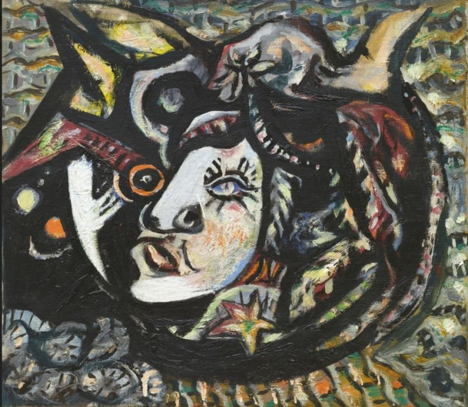

## 基本信息

- 作者：[[波洛克 Jackson Pollock]]
- 创作年代：1941
- 材质：(*not from wiki*)
- 尺寸：(*not from wiki*)
- 现存地：(*not from wiki*)

## 画面与技法

波洛克梦境绘画期作品，与《[[鸟 (波洛克) Bird (Pollock)]]》《[[出生 (波洛克) Birth (Pollock)]]》同期，明显追求 [[超现实主义 Surrealism]] 美学。"面具"母题与原始主义、部落艺术参照有关 (*not from wiki*)。

## 历史背景 (*not from wiki*)

1941 年波洛克接受荣格派分析治疗已数年，对面具、原始主义、神话题材有持续兴趣——与同期纽约流亡的超现实主义画家交流频繁。

## 图片清单

| 编号 | 出自 | 描述 |
|---|---|---|
| 01 | [[096｜波洛克：什么是当代艺术的第一个流派？]] | 面具 Mask (1941) |

## 出现在

- [[096｜波洛克：什么是当代艺术的第一个流派？]]
