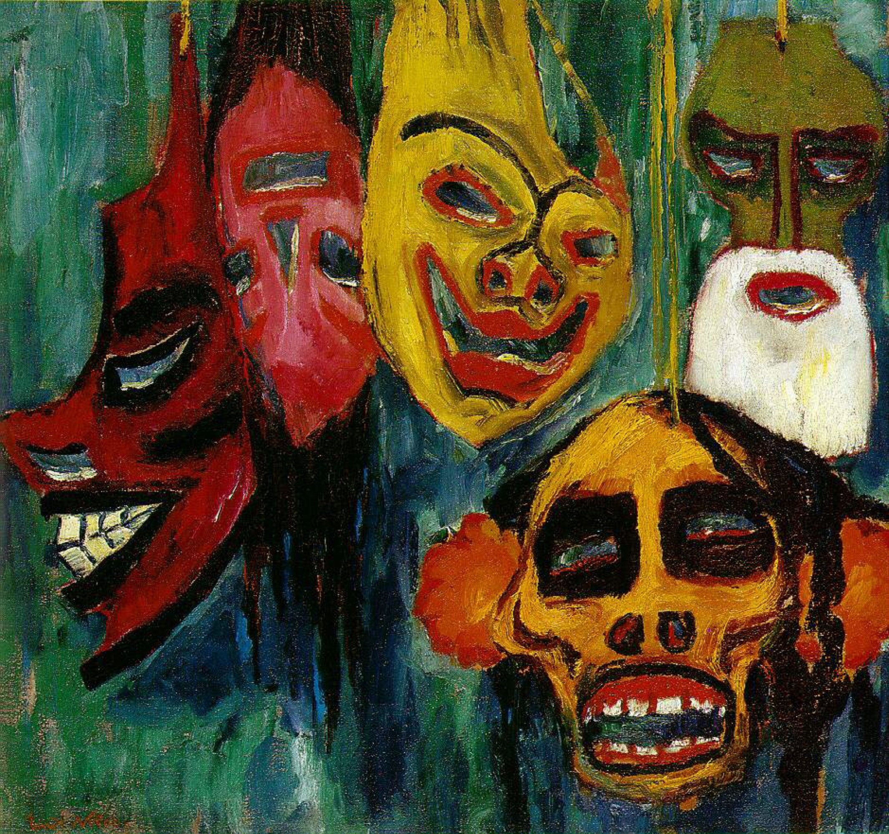

## 基本信息

- **作者**：[[诺尔德 Emil Nolde]]
- **创作年代**：1911
- **材质**：布面油画 (*not from wiki*)
- **尺寸**：73 × 77.5 cm (*not from wiki*)
- **现存地**：华盛顿国家美术馆 National Gallery of Art, Washington (*not from wiki*)

## 画面与技法

- 072 与 [[秋天的海 (诺尔德) Autumn Sea]]、[[基督上十字架 (诺尔德) The Life of Christ]] 同组——综合期"凡·高+马蒂斯、毕加索+高更"式混搭代表。
- **面具题材**——对接 [[毕加索 Pablo Picasso]] 式**非洲木雕借鉴**——诺尔德也参与了 1910 年前后欧洲艺术界对部落 / 异域物件的"原始主义"挪用。

## 历史背景 (*not from wiki*)

1911 诺尔德参观柏林民俗博物馆 (Ethnological Museum) 大量临摹非洲与大洋洲面具——这种异域元素与北方哥特激情的化合，导向其后期的形崩溃语言。

## 图片清单

| 编号 | 出自 | 描述 |
|---|---|---|
| 01 | [[072｜桥社：什么是表现主义绘画的使命？]] | Mask Still Life III 1911 |

## 出现在

- [[072｜桥社：什么是表现主义绘画的使命？]]
