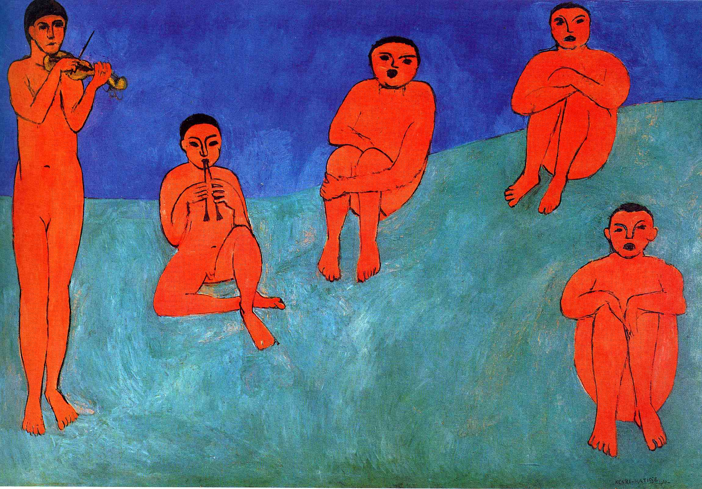

## 基本信息

- 作者：[[马蒂斯 Henri Matisse]]
- 创作年代：1910
- 材质：油画 (*not from wiki*)
- 尺寸：(*not from wiki*)
- 现存地：(*not from wiki* 圣彼得堡 / 冬宫博物馆)
- 委托人：[[史楚金 Sergei Shchukin]]

## 画面与技法

与 [[舞蹈 (马蒂斯) Dance (Matisse)]] 构成 1910 年为 [[史楚金 Sergei Shchukin]] 创作的**双联壁**——062 顾衡定性："**这两幅作品，可以被视为马蒂斯走出野兽派之后的代表作。**"

要点（062）：

- 与《舞蹈》形成对比：**一动一静，一明一暗**
- 色彩全部 [[平涂 Flat Colour]]、没有表现阴影、要素简化到极致
- **比例服从色彩**的样板（062 关键案例）——"如果马蒂斯觉得画面上红色太多了的话，他会**毫不犹豫地把某个人变小**"
- 在他看来，**人与人在空间中比例的准确，远不如颜色与形状之间和谐的关系**来得重要——本作直接印证 [[准确不等于真实 Accuracy is Not Truth]] 这一命题

## 历史背景 *(not from wiki)*

(*not from wiki*) 1910 年为俄国收藏家 [[史楚金 Sergei Shchukin]] 莫斯科宅邸装饰委托所作，与《舞蹈》同期。现存圣彼得堡冬宫博物馆。

## 图片清单

| 编号 | 出自 | 描述 |
|---|---|---|
| 01 | [[062｜马蒂斯3：如何理解他一生的创作？]] | 五人静坐演奏 / 蓝绿底色 / 红色人物 |

## 出现在

- [[062｜马蒂斯3：如何理解他一生的创作？]] —— 马蒂斯走出野兽派之后的代表作之一，亦是 [[准确不等于真实 Accuracy is Not Truth]] 命题的案例画
