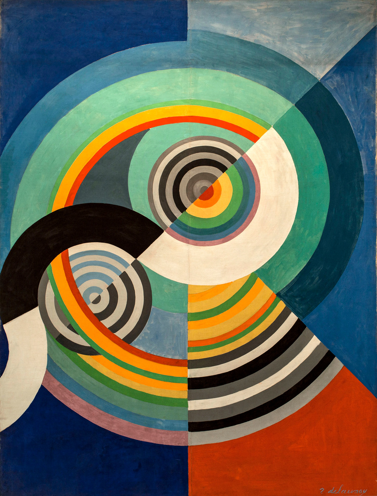

## 基本信息

- 作者：[[德劳内 Robert Delaunay]]
- 创作年代：1912
- 材质：布面油画 (*not from wiki*)
- 尺寸：约 130 × 90 cm (*not from wiki*)
- 现存地：私人收藏 / 数版本 (*not from wiki*)

## 画面与技法

德劳内"**韵律**"母题的早期作品。画面以**多组同心圆与扇形色块的交错**为主，已经几乎完全抽象——但还保留了一丝纵向构图、似乎是"舞动的身体"的暗示。

顾衡视角：是德劳内**把音乐与色彩对应**的视觉成果——音节频率有比例关系，色彩同样可以被精确组合成"和声"。

## 历史背景 (*not from wiki*)

"韵律 (Rythme)" 是德劳内 1912 年起反复使用的母题，与 [[同时性绘画 Simultaneous Paintings|同时性绘画]] 并列为他后期理论的核心命名。

## 图片清单

| 编号 | 出自 | 描述 |
|---|---|---|
| 01 | [[068｜立体主义，除了毕加索还值得了解什么？]] | 1912 早期"韵律"母题 |

## 出现在

- [[068｜立体主义，除了毕加索还值得了解什么？]] —— "色彩 = 音乐"理念的视觉化
