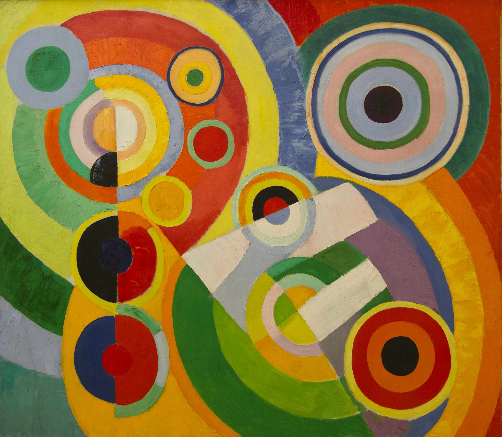

## 基本信息

- 作者：[[德劳内 Robert Delaunay]]
- 创作年代：1930
- 材质：布面油画 (*not from wiki*)
- 尺寸：约 200 × 228 cm (*not from wiki*)
- 现存地：巴黎现代艺术博物馆 (Centre Pompidou) (*not from wiki*)

## 画面与技法

德劳内**晚期**作品，体量更大、色彩更鲜亮。画面被**大型同心色环主导**——像[[第一盘 (德劳内) First Disc|《第一盘》]]的放大复杂版；色环旋转、互相覆盖、内含弧线运动，**完全抽象 + 运动元素**。

1913 年起德劳内受**未来主义**影响开始引入运动元素；本作 1930 年是该理念**成熟期**的代表作。

## 历史背景 (*not from wiki*)

与 [[马蒂斯 Henri Matisse]] 1905–1906 年的 *Bonheur de vivre*（《生之欢愉》）共享标题中的"生活的乐趣 (joie de vivre)"——但马蒂斯是用色彩表达地中海异教式的官能，德劳内则用纯抽象的色环表达**宇宙节律的欢愉**。

## 图片清单

| 编号 | 出自 | 描述 |
|---|---|---|
| 01 | [[068｜立体主义，除了毕加索还值得了解什么？]] | 1930 年晚期"色环 + 运动"成熟期作品 |

## 出现在

- [[068｜立体主义，除了毕加索还值得了解什么？]] —— 受未来主义影响后的运动型抽象代表作
