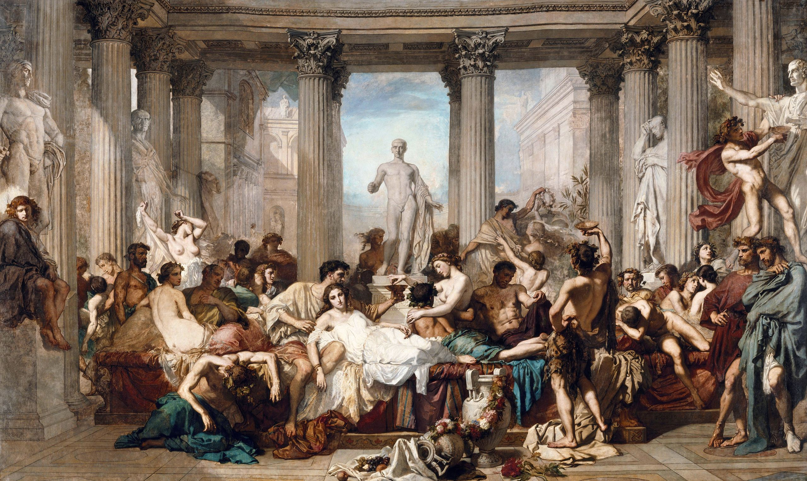

## 基本信息

- 作者：[[库退尔 Thomas Couture]]
- 创作年代：1847
- 材质：油彩，画布 (*not from wiki*)
- 尺寸：472 × 772 cm (*not from wiki*)
- 现存地：奥赛博物馆，巴黎 (*not from wiki*)

## 画面与技法

[[库退尔 Thomas Couture]] **1847 年沙龙金奖**作品——也是他"**[[新古典主义 Neoclassicism]] 的素描 + [[浪漫主义 Romanticism]] 的色彩**"折中路数的代表作。

> "题材和人物造型都是新古典主义的，但是在着色的阶段，库退尔故意保留了**自由和松动的笔触**。这是德拉克罗瓦的手法，安格尔是一定要把笔触全部隐藏起来的。"

这条路数后来被库退尔的学生 [[马奈 Édouard Manet]] 继承——马奈终身的"**精准素描 + 自由奔放的笔触**"正是这一系。

## 历史背景 (*not from wiki*)

- 题材取自尤维纳利斯《讽刺诗》：罗马帝国晚期的奢侈与堕落
- 1847 沙龙金奖让库退尔一跃成为巴黎画坛红人，吸引了 [[马奈 Édouard Manet]] 等学生
- 后由法国政府收购，今藏奥赛博物馆

## 图片清单

| 编号 | 出自 | 描述 |
|---|---|---|
| 01 | [[039｜马奈2：画家如何应对照相机的冲击？]] | 全图 |

## 出现在

- [[039｜马奈2：画家如何应对照相机的冲击？]]
