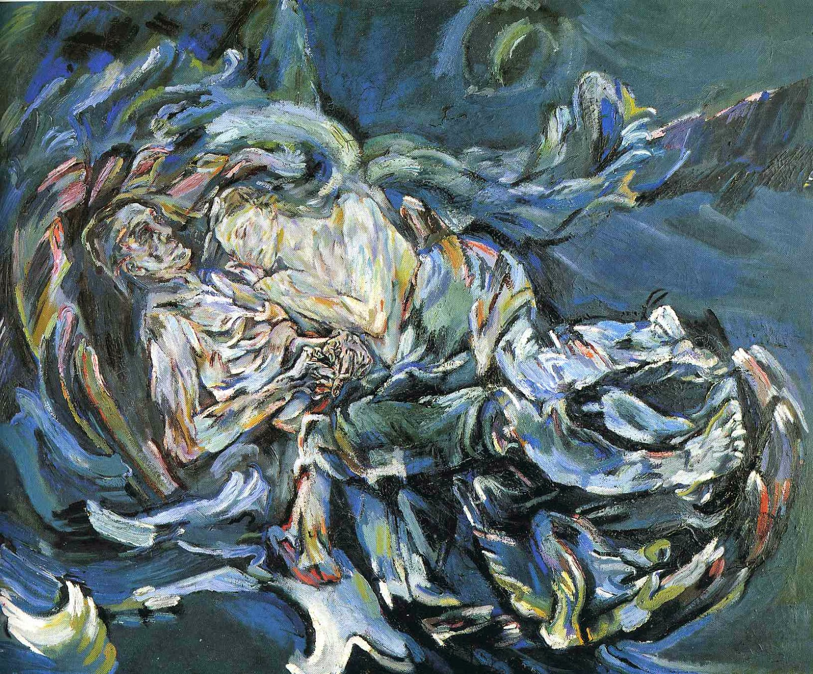

## 基本信息

- 作者：[[柯科施卡 Oskar Kokoschka]]
- 创作年代：1913–1914
- 材质：布面油画 (*not from wiki*)
- 尺寸：1.8 m × 2.2 m（顾衡 076：**1 米 8 高，2 米 2 长**）
- 现存地：巴塞尔美术馆 Kunstmuseum Basel (*not from wiki*)

## 画面与技法

- 顾衡 076 视角下的画面解读（**双重视角并置**——这是本课的核心案例）：

### 作者（柯科施卡）的解读

> 云雨过后，新娘心满意足地睡着了，新郎却陷入深深的不安。心爱的女人虽然就在他身边酣睡，但他却明显感觉到她正离他而去。新郎目光呆滞，深深的绝望中掺杂着一丝怨恨和不甘。

柯科施卡为这幅画配了一首小诗：

> - 我退缩在
> - 对自己肉体的体认中
> - 惺惺相惜于
> - 对一位少女的倾诉

### 模特（艾尔玛）的解读

> 你看看，他把自己画得像个国王。

艾尔玛从画里看到的是柯科施卡**强烈的控制欲**。

### 顾衡 076 的总结

同一幅画，连模特和画家的解读都不一样。当 [[表现主义 Expressionism]] 用来表达**德意志民族性**的时候，它起码是可以被描述的；而当表现主义用来表达**创作者个人层面的 Emotion / Passion** 时，**创作者与观者是根本尿不到一个壶里去的**。观者面对一幅表现主义绘画当然会产生感受，但这感受却**和创作者完全无关**——这正是表现主义脱离德国家乡后面临的最大难题和困惑。

## 历史背景 (*not from wiki*)

- **女主角**：[[艾尔玛 Alma Mahler]]——作曲家、指挥家 [[马勒 Gustav Mahler]] 的妻子。马勒死后，艾尔玛与柯科施卡发展恋情。
- **创作触发**：艾尔玛怀孕后，柯科施卡求婚被拒——艾尔玛打掉孩子，并对柯科施卡说"你必须完成一幅'大作品'才能娶我"。其实这是托词——艾尔玛和老情人 [[格罗庇乌斯 Walter Gropius]] 旧情未断，柯科施卡只是备胎。柯科施卡却信以为真，画了这幅《风中新娘》。**刚画完，艾尔玛就和他分手了**。
- **风格归属**：常被视为奥地利—维也纳系 [[表现主义 Expressionism]] 代表作之一；现藏巴塞尔美术馆。

## 图片清单

| 编号 | 出自 | 描述 |
|---|---|---|
| 01 | [[076｜表现主义到底要表现什么？]] | 全图——左侧艾尔玛酣睡，右侧柯科施卡目光呆滞 |

## 出现在

- [[076｜表现主义到底要表现什么？]] —— 作为"作者—观者解读完全不同"的核心例证；表现主义脱离 Willing 切换到 Passion 后的困境标本
