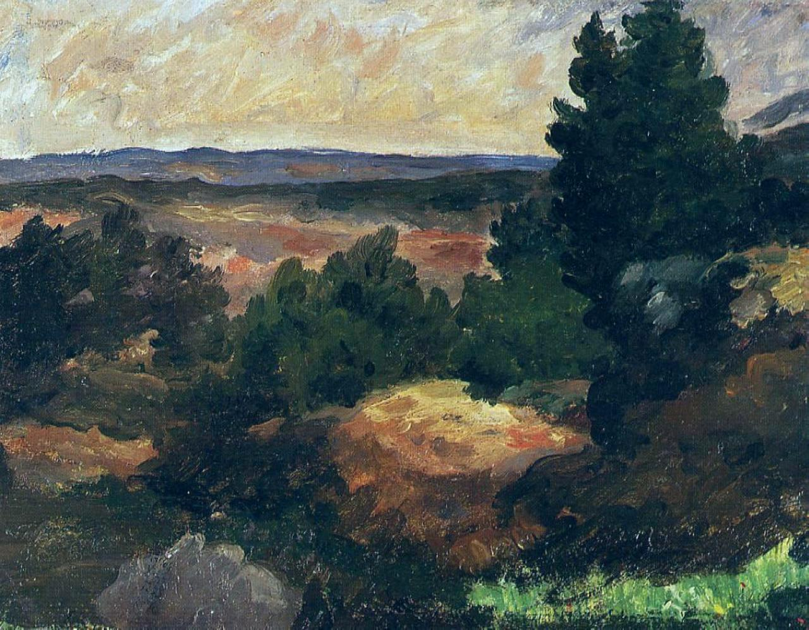

> 标题仅"风景"过于泛指，本页采用"风景 (塞尚 1867) Landscape (Cézanne 1867)" 形式消歧——塞尚一生画过多幅"风景"。

## 基本信息

- 作者：[[塞尚 Paul Cézanne]]
- 创作年代：1867
- 材质：油彩，画布 (*not from wiki*)
- 尺寸：(*not from wiki*) 不详
- 现存地：(*not from wiki*) 不详

## 画面与技法

塞尚 1867 年风景习作。顾衡 052 用其作为 **"塞尚艺术观的两个来源：[[艺术的道统 (形式美) Artistic Lineage|逻辑]] 和 观察"** 的视觉锚点。

- **"逻辑"**——来自卢浮宫临摹大师 400 多幅作品所沉淀的"艺术家共同体的知识传承"，即 **形式美的内在逻辑**。
- **"观察"**——对外在客观大自然的写生。
- **整合方式**——不是把客观同化为主观（不是"香肠机"），而是 **建立两个互相平行的世界**：一个是眼睛所见的客观世界，一个是脑袋里符合艺术道统的主观世界。

塞尚名言（052 引用）：

> "我们只有通过自然才能进入卢浮宫，同样我们也只有借助卢浮宫才能回到自然。"

此画体现塞尚以色彩塑形、用色刀厚涂、阔大笔触的早期典型手法——但**对象是大自然**，与同期"画我所想"的宗教幻象作品（如 [[耶稣在灵薄狱 Christ in Limbo]]）形成内在张力。

## 历史背景 (*not from wiki*)

塞尚 1862 年到巴黎、未考取艺术学院、对学院派起叛逆心；1863 年在 [[落选者沙龙 Salon des Refusés]] 看到马奈 [[草地上的午餐 The Luncheon on the Grass|《草地上的午餐》]]。此 1867 年风景属塞尚正寻找自己声音的"前印象派"时期。

## 图片清单

| 编号 | 出自 | 描述 |
|---|---|---|
| 01 | [[052｜塞尚1：为什么他是西方现代绘画之父？]] | 全图 |

## 出现在

- [[052｜塞尚1：为什么他是西方现代绘画之父？]]
